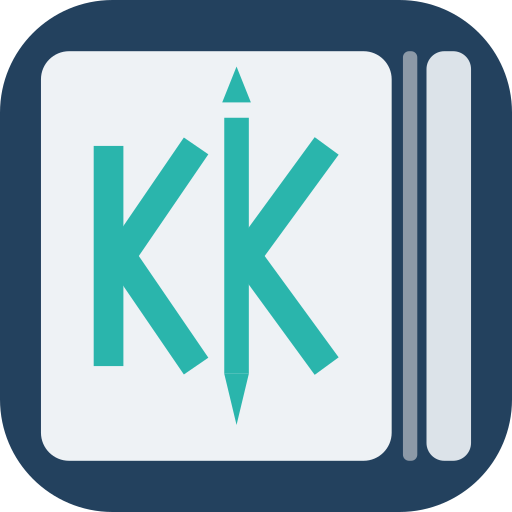

# KK-Notes



A React + TypeScript notes app for 2-in-1 pen/touch laptops: a low-latency
inking engine (`src/inking/`) with palm rejection, pressure-sensitive strokes
via [perfect-freehand], STEM shape tools and hold-to-snap, hosted in a
multi-page document system (`src/document/`) behind a document library home
screen with folders and cross-device sync (`src/library/`,
`src-tauri/notes-sync/`), with procedural page templates,
canvas virtualisation, a Samsung Notes-style page arranger, a media layer of
images, sticky notes, typed text and tables, a lasso selection tool, two-finger pan / pinch-zoom navigation, a read-only
lock, a disappearing laser pointer, notebook covers, vertical *and*
horizontal continuous scrolling, and PDF import / fillable AcroForms /
vector PDF export (`src/pdf/`). The interface is icon-first: a fixed top
bar for document context and a draggable floating palette for drawing.
Styled
with Tailwind CSS and follows the system light/dark theme.

```bash
npm install
npm run dev            # Vite dev server (web)
npm test               # unit tests (vitest)
npm run typecheck      # strict tsc
npm run build          # typecheck + production bundle + bundle guard
npm run check:bundle   # assert pdf.js / pdf-lib are lazy chunks
npm run check:ui       # Playwright: stacking order and hit-testing at real viewport sizes
npm run icons          # redraw the app icons and the favicon from one geometry
npm run check:rust     # cargo check of the Tauri shell (Windows MSVC target, no TLS)
npm run test:rust      # the sync engine and the HTTP transport (no webview needed)
npm run check:android  # assert the Android project carries this repo's customizations
npm run desktop:dev    # Tauri v2 desktop shell, hot reloading
npm run desktop:build  # NSIS / MSI installers (run on Windows)
npm run android:dev    # run on a connected Android device / emulator
npm run android:apk    # ./build-android.sh — checks the toolchain, then builds a debug APK
```

## Desktop shell (Tauri v2, `src-tauri/`, `src/ui/
├── Tooltip.tsx             hover / focus / long-press tooltip
├── IconButton.tsx          icon + tooltip + loud active state
├── Popover.tsx             anchored flyout panel
├── dragBounds.ts           pure clamping for the floating palette
├── dock.ts                 which edge a drop docks to, and where a docked panel sits
├── idleHide.ts             when an unpinned toolbar hides, and the hook that applies it
└── useDraggablePanel.ts    transform-driven dragging, edge docking, re-clamped on resize

src/desktop/`)

**Setup (Windows 2-in-1 target).** Install Node 22, Rust via
[rustup](https://rustup.rs) (the MSVC toolchain, which needs the *Desktop
development with C++* workload of the Visual Studio Build Tools) and make sure
the WebView2 runtime is present (it ships with Windows 11; the NSIS/MSI
bundles download it otherwise). Then:

```bash
npm install                 # installs @tauri-apps/api, plugin-dialog, plugin-fs, @tauri-apps/cli
npm run desktop:dev         # starts Vite and the Tauri window
npm run desktop:build       # installers in src-tauri/target/release/bundle/
npm run icons               # redraw every app icon from scripts/make-icons.mjs
```

**Without a Windows toolchain of your own:** *Actions → Windows installer → Run
workflow* builds the NSIS setup `.exe` on GitHub's Windows runner and attaches it
to a `windows-<run>` release as a plain download. It builds NSIS only — the MSI's
WiX toolchain is fetched at build time and is the likeliest thing to fail for
reasons unrelated to this code — and it reads the **Desktop** OAuth client id from
the `NOTEX_GOOGLE_DESKTOP_CLIENT_ID` repository variable (the Android workflow's
`NOTEX_GOOGLE_CLIENT_ID` holds the Android client; they are different clients).
The installer is unsigned, so Windows shows "Windows protected your PC": *More
info → Run anyway*.

From a non-Windows host the Rust side can still be verified without the
GTK/WebKit libraries: `npm run check:rust` runs `cargo check` for the
`x86_64-pc-windows-msvc` target (add it with `rustup target add`).

**Configuration** (`src-tauri/tauri.conf.json`). One maximized, resizable,
natively-decorated window that follows the system theme like the web UI;
WebView2 launched with hardware-accelerated rasterisation
(`--enable-gpu-rasterization --enable-zero-copy`) and Edge UI features off;
`dragDropEnabled: false` so HTML5 image/PDF drops keep reaching the page;
zoom hotkeys off; a CSP that permits the pdf.js worker, wasm codecs, data and
blob URLs and the IPC origin; `.notex` registered as a file association.
`src-tauri/capabilities/default.json` grants `dialog:default`, `fs:default`
with read/write scope under `$APPDATA`, and the window permissions used for
fullscreen, maximize and title updates.

**Rust commands** (`src-tauri/src/commands.rs`), all with atomic temp-file +
rename writes:

| Command | Purpose |
| --- | --- |
| `save_document(path, contents)` / `open_document(path)` | `.notex` JSON on disk |
| `write_binary_file` | raw IPC body → file (PDF export lands on disk without a blob download); destination in the percent-encoded `x-path` header |
| `save_draft` / `load_draft` / `clear_draft` | autosave in `app_data_dir/drafts/autosave.notex` |
| `list_recent` / `add_recent` / `remove_recent` | last five documents in `app_data_dir/recent.json`, de-duplicated, pruned when files vanish |
| `get_startup_file` | the `.notex` passed on the command line (file association), handed out once |

**`.notex` format** (`src/desktop/notex.ts`). A versioned envelope
`{ format: 'notex', version: 1, savedAt, app, document }` around the document
serialization: title, view mode, zoom, pages with dimensions, template and
config, background colour, stroke arrays (freehand and geometric), the media
layer (images as data URLs, sticky notes, tables), AcroForm fields and
values, and PDF sources stored once as base64. Files written before notes and
tables existed carry an `images` array instead, which is migrated to `media`
on load. A bare serialized document (`.json`) is also accepted. Undo history
is not persisted.

**Frontend integration** (`src/desktop/`). `tauri.ts` detects the shell and
lazy-loads the `@tauri-apps/*` modules so the web build never pays for them.
`fileService.ts` implements Save / Save As / Open / Export PDF / drafts /
recents / fullscreen over the Rust commands and native dialogs, with browser
fallbacks (downloads, a file input, `localStorage` drafts). `fileActions.ts`
holds the File-menu actions (with an unsaved-changes prompt),
`useDesktopIntegration.ts` opens a startup file or offers the autosaved draft,
debounces autosave 1.5 s after content edits, keeps the window title in sync
with a dirty marker, binds `Ctrl+N/O/S/Shift+S/E` and `F11`, and suppresses
the WebView context menu outside text fields (Windows Ink press-and-hold would
otherwise open it mid-stroke). Dirty tracking compares the page array and
title against the last saved snapshot, so scrolling and zooming never count as
edits.

**Autosave costs one page, and waits for the pen.** A draft is written 1.5 s after the
last edit, and writing one is not free: serialising the document — about a tenth of a
second per hundred thousand points, so a fully annotated notebook is a stall of that
order — plus handing it across to the shell, all on the thread that follows the pen.
That stall landed in the middle of the *next* stroke (each stroke restarts the wait,
and the wait ends in the pause before the following one) and grew with every page of
notes; on the ROG Flow Z13 the overlay's `worst` read 500–800 ms. Two changes. Pages
are immutable — an edit makes a new one and shares the rest — so `serializePageJson`
keeps each page's JSON in a `WeakMap` keyed by the page object, and a save re-serialises
only the page that was written on; PDF sources' base64 is cached the same way, by
buffer (`encodeNotex` writes the envelope by hand around the cached pages, and parses
to exactly what `buildNotex` describes). And a draft that comes due while the pen is on
the page or hovering just above it is put off and looked at again every 750 ms
(`desktop/autosave.ts`), running once the pen has gone quiet — but never for more than
20 s, because a draft is what a crash restores from. The window title is only set
when it changes: it used to be sent to the shell on every change to the document
store, which includes turning a page and making a selection.

**Fullscreen styles** (`desktop/borderless.ts`, `fileService.toggleFullscreen`).
F11 does one of two things, chosen in *Settings → Fullscreen* and defaulting to the
first. **Borderless window** takes the title bar off and fills the work area — the
monitor less the taskbar, and one physical pixel short at the bottom so a window on a
monitor with an auto-hidden taskbar (whose work area is the whole monitor) does not
cover it either. To Windows that is an ordinary window, composited like a maximised
one, which is the mode the ROG Flow Z13 was fine in. **Full screen** is the
platform's own (tao's borderless fullscreen: resized to cover the monitor, the taskbar
told to step aside, the same as Chromium's F11), which on that tablet made the mouse
pointer lag and blink. Leaving puts back what was there — a maximised window
maximised again, otherwise its size and position — and turns off whichever is on,
whatever the setting says by then. A monitor that reports no usable geometry falls
back to the platform fullscreen. The window commands it needs are in the
capabilities (`set-decorations`, `set-position`, `set-size`, `current-monitor`,
`outer-position`, `outer-size`). The performance overlay's `mode` row says
`borderless`, `fullscreen` or `windowed`.

**Stylus buttons.** `resolveEffectiveTool` maps hardware buttons per the
*Stylus* settings in the palette. Two bits of `PointerEvent.buttons` are
buttons: 2 is the **barrel** button and 32 is the **eraser** flag. A pen with a
real eraser end sets 32 while that end touches, but Windows also reports a pen's
*second* button that way, so on a pen with no eraser end and no Bluetooth the
"eraser" bit is simply the other button. The settings therefore call it the
*second button* and let it borrow any tool (default: the lasso). The barrel
button carries two gestures, told apart by how long it is held
(`src/inking/engine/barrelButton.ts`):

| Gesture | Threshold | Effect |
| --- | --- | --- |
| **Click** | released inside `BARREL_CLICK_MS` (300 ms) | toggles the active tool between a user-chosen pair, e.g. pen ⇄ stroke eraser |
| **Hold** | still down at 300 ms | borrows one tool — lasso, laser pointer, an eraser — and puts the previous one back the moment the button is released |

The state machine is pure: `barrelDown` / `barrelUp` / `barrelTick` /
`barrelCancel` take a state and a timestamp and return the next state plus an
action, so the whole click-vs-hold decision is unit-testable without a stylus.
A few decisions are deliberate and pinned by tests:

- A long press *is* a hold even if no tick ever fires. Silence never becomes a
  click, so a slow release can't fire the toggle by accident.
- The borrow happens at the 300 ms tick, not on release, which is what makes
  "hold to lasso, drag, let go" feel immediate.
- `barrelCancel` (the pen leaving the digitiser mid-press) restores a borrowed
  tool but never fires a click: we never saw that press end.

`stylusBarrel.ts` drives it from the surface and owns the one `setTimeout` the
promotion needs — a button held down emits no further pointer events, so
nothing else would wake it. That driver is module-level rather than per-page
because the pen can cross a page boundary mid-hold.

Drawing with the barrel down borrows the same hold tool, rather than a third
setting that could disagree with it. A barrel press while merely hovering is
ignored.

**Which button is which.** Nothing in the web platform says which physical
button a pen reports as bit 2 and which as bit 32; it depends on the pen and its
driver. So *Stylus buttons* in the settings has a **pen button test**: press
each button with the pen over the panel and it prints what the browser saw —
`tip`, `barrel (2)`, `second / eraser (32)` — live, straight from `e.buttons`.
Whichever of those it names for a button is the row to set. The shipped mapping
is *barrel hold → stroke eraser*, *second button → lasso*, and the click gesture
is left as pen ⇄ stroke eraser to be chosen later.

**A held button that takes the lasso keeps it (`src/document/toolBorrow.ts`).** A
button can borrow any tool for as long as it is held, and for an eraser that is the
whole story. A lasso is different: it leaves a *selection*, and the selection only
lives while the lasso is the active tool — so handing the pen back the moment the
button came up cleared the selection with it, and a lasso taken by the second
button selected something nobody could see. (Worse, Delete would still have removed
those invisible strokes.) Now a borrowed lasso is kept while there is something
selected, or a loop still being drawn, and handed back when the selection is
dismissed (Escape, Deselect, delete, a tap outside it), when a loop selects nothing,
or is superseded by the user choosing another tool. It is the same for the barrel
button's hold, and the second button can now also be the select tool, which
before did nothing.

Two ordering details matter here. The stroke is closed *before* the button is read
on pointer-up: lifting the tip and releasing the button are often one motion, and
reading the button first ended the hold before the loop had become a selection.
And a barrel press that touches the page is a stroke, not a click
(`barrelConsume`): the click/hold machine only saw the button, so an erase swipe
made with it held — press, touch, drag, lift, release, all inside 300 ms, which a
quick swipe is — was read as a click and swapped the pen for the eraser afterwards.

The mapping is stored in the preferences (`stylus`), not in the tool settings it
used to live in: tool settings reset with every launch, and a button you had to
re-assign each morning is a button you stop assigning. `normalizeStylus` reads
it back defensively — an unknown tool name falls back to that field's default
rather than discarding the whole mapping.

**Bundle.** pdf.js and pdf-lib are only reached through dynamic `import()`
(raster client, PDF background, exporter, `React.lazy` import dialog), so the
entry chunk is ~330 kB instead of ~1.2 MB; `scripts/check-bundle.mjs` fails
the build if either library ends up in the critical path.

## Document library and sync (`src/library/`, `src-tauri/notes-sync/`)

The app opens on a **library**, not a document: folders and cards for
everything written, in a grid or a list, sorted by name, date modified or date
created. Opening a card routes to the document; *Back to library* in its top
bar routes back.

**Routing** is a three-line reducer (`routeStore.ts`) rather than a router
dependency, because there are exactly two views and one of them has no URL to
speak of. `nextRoute` is pure, so the navigation rules are tested without
mounting anything, and it returns the *same object* when nothing changes so a
no-op navigation cannot re-render the tree it was meant to leave alone. A
document remembers the folder it was opened from, so going back lands where it
started rather than at the root; *Home* goes to the root, which is the way out
of a library navigated deep into.

Leaving a document **releases it**. A document is the largest thing the app
holds — every page's strokes, every embedded image as a data URL, any imported
PDF — with decoded page bitmaps in the raster cache on top, and `ImageBitmap`
holds memory outside the JS heap, so dropping the reference is not enough.
`releaseDocument` resets the store and clears the cache, closing each bitmap.
The two views are swapped rather than both kept mounted behind a CSS toggle,
for the same reason.

**Thumbnails come out of the file, not out of the document.** A library of a
hundred notebooks cannot parse a hundred documents to draw a hundred cards.
`notes-sync`'s `read_thumbnail_source` deserialises a `.notex` straight into a
struct that keeps page one: `serde_json` reading into typed structs is a
streaming parser, so the fields the target does not declare — the other pages,
and `pdfSources`, which carries whole imported PDFs as base64 and is routinely
the largest thing in the file — are consumed as `IgnoredAny`, advancing over
the tokens without building a value. A custom `FirstOf<T>` visitor does the
same for the pages array. The file is read once and the peak retained memory
is one page. The frontend then hydrates that page alone and rasterises it with
the same renderer the page snapshots use, and only for cards actually on
screen (an `IntersectionObserver` gates the work). A page that references a
PDF is drawn without it: fetching the source to fill a 200 px card would undo
the whole point.

**Folders** are real directories and filing a note is a real move — drag a
card onto a folder. Nothing overwrites: a name already taken gets a numbered
suffix, because dragging a file onto a folder is not a request to destroy
what was already called that. Every path from the frontend is checked against
the library root before it is used, since one `..` in a folder name is all it
takes to write somewhere else by accident.

**Searching every note.** The box in the library's toolbar (`Search all notes`) looks inside every
note, folders included, and lists each one once with the first three places the words are in it; choosing
a note, or one of its lines, opens it at that page with the object selected (`search/reveal.ts`, the same
call the in-note search makes). The words come from the files without opening the notes: `notes-sync`'s
`read_document_text` deserialises a `.notex` into a struct that declares only each media object's `kind`,
`text` and table `cells`, so ink, images and embedded PDFs are walked and dropped, like the thumbnail.
What was read is kept by the `NoteIndex` keyed by each file's modified time, so the next search is
instant and only a note that changed is read again (four at a time, the results filling in as they come);
the notes are read when the box goes from empty to something, not on every letter. Matching is the
in-note search's own `searchSources`, so the two agree. A note is also found by its title and file name.
Handwriting is ink and cannot be searched, and the words of a PDF a note was made from are only searched
inside that note.

**Favourites and tags** (`noteMeta.ts`, `TagsDialog.tsx`). Every note card has a star and a tag button (over
the corner of the picture in the grid, at the right in the list). A starred note, or one with tags, is
found again through the chips under the toolbar — *All notes*, *Favourites*, and each tag with how many notes
carry it — which switch the library to a view **across every folder** (the same walk the library search
makes), sorted as the library is. Tags are typed separated by commas (up to eight, 24 characters each, `#`
optional, the same tag in two spellings is one), with the tags already in use offered as suggestions. The
chip bar appears once there is anything to show, so a library without them is not cluttered.

- **Kept on this device**, in `localStorage` (`notes.library.meta.v1`) keyed by the note's path, not inside the
  note. Putting a word in a notebook would mean rewriting (and re-syncing) the whole file, PDF and all; the cost
  is that tags do not follow a note to another device. Moving a note or folder in the library moves its entries
  (the path rewrite understands both `/` and Windows' `\`, and does not catch a folder whose name merely begins
  the same), deleting one drops them; a note moved from outside leaves a harmless orphan.
- A tag that no note carries any more, or the last favourite going, puts the view back to *All notes*
  rather than leaving it empty.

### Version history (`notes-sync/src/history.rs`, `components/VersionHistory.tsx`)

*File → Version history…* lists the earlier saves of the open note, each with when it was saved, how long
ago, its title, pages and size, and puts one back. Saving replaces the file, so before it does, the shell's
`save_document` keeps the file as it stands (an `fs::copy`, named for the file's own modified time, which is
when that version was saved) in the app's data folder under `history/<hash of the path>/` — not in the
library, so it is neither listed as a note nor synced. Failing to keep it never stops a save.

- **Thinning.** Saves closer than five minutes are one version, and a file saved again without a change is
  not a new one (same bytes as the newest). After each copy the folder is pruned: in the last hour one version
  per five minutes, in the last day one per hour, then one per day, nothing older than 60 days, no more than 40
  in all, and past the newest no more than 400 MB (a note with a PDF in it is large). The newest is always kept.
- **Restoring** copies the chosen version over the note, but first keeps what is there, whatever the
  five-minute rule says, so a restore can itself be undone by restoring the version it made. If the note on
  screen has unsaved changes they are saved first (and so kept). The dialog asks first and says so.
- **Limits.** The history belongs to a note's path, so moving a note to another folder starts a fresh one; a
  note opened through Android's file picker (a `content://` URI) is saved through the filesystem plugin and
  has none; the browser build has none (it has no saves).
- Unit-tested in Rust (naming, the gap and duplicate rules, every step of the schedule, the caps, forced
  copies, junk in the folder); the dialog is browser-checked against a stand-in for the shell.

### App passcode (`src/lock/`, `library/SecurityPanel.tsx`)

The shield in the library's header sets an optional passcode. With one set the app starts on a lock screen
and, if chosen, locks itself after 1, 5, 15 or 30 minutes of not being used (a pointer, key, touch or wheel
counts as using it; the time is checked every 15 s and the moment the window returns to the front, because
a sleeping tablet's timers are slowed). *Lock now* and **Ctrl+Shift+L** lock at once.

- **What is stored** is a salted PBKDF2-SHA-256 hash (300 000 rounds, stored with the record so it can be
  raised), compared without stopping at the first difference. The key is `notes.lock.v1`, separate from the
  preferences so that *Reset to defaults* is not a way round the lock.
- **While locked** the app stays mounted, so unlocking returns to exactly where you were, but its container is
  `inert` and hidden from screen readers, the lock screen is opaque and above everything, and a capture-phase
  key handler stops every key that is not going to the lock screen before anything else sees it (Ctrl+Z,
  Ctrl+S and Delete must not reach the note behind it).
- **Wrong tries**: the first five are free, then the wait is 30 s and doubles each time, up to five minutes.
- **What it is not.** It is a lock on the app, for a device left lying around. It is not encryption: the notes
  are ordinary files in the library folder, and the window's title still names the open note. And a forgotten
  passcode cannot be recovered from inside the app; the panel says so where the passcode is set.

### The sync engine

`src-tauri/notes-sync/` is a workspace crate with **no Tauri dependency**. The
shell cannot be compiled — let alone tested — without a platform webview, and
none of this needs one, so `npm run test:rust` runs its tests
anywhere. The Tauri side (`library_commands.rs`) is a thin IPC surface over it.

**Watching.** A `notify` watcher over the library feeds a thread that waits
for a burst to settle before reporting: an atomic save is a create, a write, a
flush and a rename — four events for one edit — and the autosave fires every
1.5 s while someone is writing. Temp files and hidden files are filtered out,
so a half-written document is never uploaded. Watching is best-effort by
nature — every backend has a window where a file created inside a directory
that was itself just created is missed, and inotify drops events when its
queue overflows — so it is an optimisation that makes sync feel immediate,
never the only trigger: the library asks for a pass when it opens, which
reconciles anything missed.

**Deciding** is three-way, not two. Comparing local against remote only says
*that* they differ, never which way to move: a file edited here looks exactly
like a file edited there. What distinguishes them is the digest recorded at
the last successful sync — the base. Against that, one side having moved means
copy it over, both sides having moved to the same content means agree on a new
base, and both having moved differently means ask. A two-way comparison is how
sync tools silently eat a page of notes. Decisions are made on SHA-256 of the
content, never on timestamps: a clock that runs fast, a tool that preserves
mtimes, a cloud client that rewrites a file byte for byte, all produce
timestamps that say "changed" about a file that did not.

**Conflicts stop the engine** rather than being guessed. Both copies are left
exactly as they are and the frontend shows a modal. *Keep both* leads, because
it is the only one of the three answers that cannot throw away work: the
incoming copy lands beside the local one as `Week 1 (conflicted copy from
<device>).notex` — the device name is there because the point of keeping both
is being able to tell them apart afterwards, and "copy 2" does not — and is
uploaded too, so both devices end up holding both versions. A deletion on one
side and an edit on the other is a conflict as well; deleting someone's edit
without asking is the one thing a sync engine must never do.

**`CloudProvider`** is the seam a real backend plugs into. Nothing in the
crate talks to a network; the trait is deliberately the intersection of WebDAV
(`PROPFIND`, `GET`, `PUT`, `DELETE`) and Google Drive (`files.list`,
`files.get`, `files.create`, `files.update`) — a flat listing keyed by relative
path, whole-file get and put, delete — so adding one is a new implementation
rather than a rewrite. Drive's file ids and WebDAV's collections are each
provider's own problem. Until an account is connected, `OfflineProvider`
refuses every operation rather than pretending one succeeded, and the status
pill reads *Offline*, which is a truthful state and not an error.

The status pill in the library's top bar shows Offline / Syncing / Up to date
/ Needs attention, pushed from Rust over a `sync://status` event after each
pass rather than polled. The cloud button beside it opens the **Cloud Sync**
panel, which is where an account is connected and disconnected.

### Google Drive

> **Setting it up:** [`docs/google-drive-setup.md`](docs/google-drive-setup.md) is
> the step-by-step for the Google Cloud side — the project, the two OAuth clients
> (Desktop and Android), the stable signing key Android needs, and where each
> client id goes. This section is how it works, not how to configure it.

The first real provider, in `notes-sync/src/drive.rs`. It still talks to no
socket: every request goes through an `HttpTransport`, so the whole of it —
URLs, multipart framing, error envelopes, conflict detection — is tested
against recorded Google responses in milliseconds, with no account attached.

**The path and the digest travel with the file**, in Drive's `appProperties`:

| key | what it holds |
| --- | --- |
| `notexApp` | marks the file as this app's, so one query finds all of them |
| `notexPath` | the file's path within the library, `/`-separated |
| `notexSha256` | the SHA-256 of the bytes as uploaded |

That choice is what makes sync cheap. `list()` is a *single* paged query no
matter how deeply the library nests, because the path does not have to be
rebuilt by walking parents; the digest arrives with the listing, so deciding
what changed costs no downloads — which is the difference between sync being
usable on a phone and not; and a file the user drags somewhere else in Drive
is still the same file, because its identity never depended on where it sits.
Folders are still mirrored for real under one **KK-Notes Sync** folder, because
someone who opens Drive should see their notebooks arranged the way they
arranged them.

**The sync loop is unchanged** — Drive only supplies the three digests the
existing three-way decision already wanted. Local moved: push. Remote moved:
pull. Both moved to different content since the recorded base: `sync-conflict`,
and the modal. Deletes are *trashes*, never erasures: a sync engine destroying
someone's only copy beyond recovery is the failure nobody forgives, and Drive's
bin is exactly the undo that a permanent delete would not have.

**A 401 refreshes once and retries once.** An access token can expire between
being fetched and being read, and a token can be revoked from Google's account
page mid-pass. One retry tells "needs a new token" apart from "this account is
gone"; a second 401 is reported rather than looped on. A *refresh* that comes
back 400 or 401 means the refresh token itself was revoked, so the account is
dropped and the UI offers signing in again — but a 5xx keeps it, because Google
being down is not the user being signed out.

#### Authentication (OAuth 2.0 + PKCE)

An installed app is a **public** OAuth client: whatever secret it shipped with,
the user can read out of the binary. PKCE (RFC 7636) is what replaces one. The
app invents a high-entropy `code_verifier`, sends only its SHA-256 to the
authorization endpoint, and produces the verifier when redeeming the code —
so an intercepted redirect carries a code that cannot be exchanged. The
derivation is checked against RFC 7636's own published vector, which is the
only way to know it interoperates before pointing it at Google.

The consent screen always opens in the **system browser**, never an embedded
webview: RFC 8252 §8.12 asks for it, Google rejects in-app webviews outright,
and the user needs to see a real address bar for a real password.

The two platforms differ only in how the redirect gets back:

- **Desktop** binds an ephemeral port on `127.0.0.1` and becomes a one-request
  web server (`notes-sync/src/loopback.rs`). Port 0, so two instances cannot
  fight over a fixed one; `127.0.0.1` rather than `localhost`, which RFC 8252
  §8.3 requires because a hostname goes through a resolver; a real HTML reply,
  because the browser is showing that tab and a dead connection would make a
  sign-in that worked look broken; a deadline, because someone who closes the
  consent screen never comes back. Requests that are not the redirect — a
  browser asking for `/favicon.ico`, a port scanner — are answered and ignored
  rather than failing the sign-in. All of it is tested by connecting real
  sockets to it.
- **Android** has no port a browser will reach, so the app claims
  `com.notex.app:/oauth2redirect` with an intent filter and `MainActivity`
  hands the URI to the page, which passes it back to Rust. The filter carries
  `BROWSABLE` — without it the system will not start an activity from a link
  and sign-in ends on "can't open page" — and no `android:host` or
  `android:mimeType`, since the redirect carries neither.

Both paths check the `state` they started with before redeeming anything, and
the scope asked for is `drive.file` alone: access to the files this app
creates, and nothing else in the account. If consent comes back without it —
Google's screen lets an individual scope be refused — the panel says so,
rather than letting it surface as a 403 on the first upload.

Tokens are kept through `tauri-plugin-store`; only the refresh token really
matters, and the access token is treated as disposable. The client id is baked
in from `NOTEX_GOOGLE_CLIENT_ID` at build time (and can be overridden by the
same variable at runtime). It is **not a secret** — that is what PKCE is for —
so the APK workflow reads it from a repo *variable*. A build without one still
runs; its Cloud Sync panel says it has no client id instead of offering a
button that cannot work.

Android needs one thing more, and it is not obvious: Google ties an Android
OAuth client to the package name **plus the SHA-1 of the signing certificate**,
and Gradle's debug signing config mints a fresh key whenever
`~/.android/debug.keystore` is missing — which on a clean CI runner is every
build. So the APK workflow restores that keystore from an
`ANDROID_DEBUG_KEYSTORE_B64` secret and prints the resulting SHA-1 in its log,
and the one-shot `Android debug keystore` workflow mints the key in the first
place (so nothing has to be installed locally to run `keytool`). Without it,
Android sign-in works for exactly one APK.

#### Where the TLS lives, and why

`notes-sync` carries no HTTP client, and neither does the Tauri shell: the
transport is its own crate, `notex-http`. A TLS stack is a C build, and the
shell's type-check cross-compiles for Windows *from Linux*, where there is no
MSVC toolchain to assemble rustls's crypto with. So `npm run check:rust` builds
the shell `--no-default-features`, where `transport.rs` supplies an
`UnavailableTransport` that fails with a sentence — every cloud code path still
compiles and still runs in that configuration, so the check is of this crate
rather than of a subset of it — while `notex-http` is compiled and tested
natively, over real sockets, by `npm run test:rust`.

**In a browser** there is no filesystem and no Rust, so `browserLibrary.ts`
keeps the same interface over `localStorage` — otherwise `npm run dev` would
be useless for working on the library itself. It is a fallback, not a second
product: there is no sync, the status stays `offline` truthfully, and a
`localStorage` quota failure is surfaced rather than swallowed.

## Document system (`src/document/`)

**State.** A Zustand store (`store.ts`) owns the `Document` (pages, active
index, view mode, zoom), a `scrollRequest` counter that asks the viewer to
scroll, the arranger's open state, the read-only lock, and the media /
lasso selections; `toolStore.ts` holds the shared tool settings. All structural edits are pure functions in `operations.ts`
(reorder, insert, duplicate with deep-cloned strokes, delete with a one-page
guard, snapshot undo/redo per page) so they can be unit-tested without React.
The inking render loop never subscribes to the store; a surface only calls
`commitStroke` / `eraseStrokes` when a gesture ends, so React updates cannot
stall a frame.

**Pages.** `Page` carries A4 dimensions (794 × 1123 CSS px at 96 DPI), a
template + `templateConfig`, background colour, the stroke list (the same
`FreehandStroke | GeometricStroke` union as the engine) and snapshot
`undoStack` / `redoStack`. `serialization.ts` round-trips a document to JSON
without history.

**Templates.** `templates.ts` generates the background lines once and feeds
two renderers: an SVG data URL used as the live page's CSS background (a few
KB, crisp at any zoom, no extra texture) and a canvas painter used by the
raster pipeline. Ruled (with margin line), grid, engineering (bold majors,
fine minors), isometric (30° triangular grid via clipped line families) and
blank/PDF placeholders. Line colours derive from the page background's
luminance unless `strokeColor` is set explicitly, so dark pages get light
lines.

**View modes.** `vertical-continuous` and `horizontal-continuous` scroll the
same page strip along different axes, and `single-page` shows one page at a
time. `layout.ts` expresses everything scroll-related along a **main axis**,
so both continuous modes share one code path: `layoutPages` places pages
down or across and centres them on the other axis, and `visibleRange`,
`currentPageIndex`, `scrollOffsetForPage` and `itemAtContent` all take the
axis. Positions stay plain `left`/`top` pairs, so `projectToPage` needs no
axis at all — a pointer anywhere in the strip lands on the right page's
local coordinates either way. The touch gestures read the axis from the
layout, so midpoint panning and pinch anchoring follow the strip.

**Notebook cover.** A document may carry an optional `cover` (`title`,
`description`, `coverColor`, `textColor`), rendered by `CoverSheet` as the
first sheet in the viewer, before page 1, in both continuous modes. It is
not a page: nothing can be drawn on it, and it takes no part in numbering,
virtualisation or export. In the layout it simply occupies the first slot
and pushes the pages along. The Page Arranger edits it (add, title,
subtitle, colours, remove), and it is part of the document's dirty state
and of the saved file.

**Viewer & virtualisation.** `layout.ts` stacks pages at the current zoom;
`DocumentViewer` mounts an `InkSurface` (two full-resolution canvases) only
for pages within 800 px of the viewport, shows a cached `ImageBitmap`
snapshot for pages within 2400 px, and renders nothing beyond that while
reserving their space. Snapshots and thumbnails come from the same pipeline
(`raster/`): a module Worker paints pages onto an `OffscreenCanvas` and
transfers the bitmap back; an LRU cache closes evicted bitmaps; a serial
main-thread queue is the fallback. Single-page mode renders just the active
page.

**Coordinates.** `InkSurface` installs `setTransform(dpr·zoom)` so every
stroke is stored in page-local CSS px, and the pointer pipeline divides
viewport offsets by the zoom (`viewportToPagePoint` / `projectToPage` in
`layout.ts`, unit-tested). Because `getBoundingClientRect()` is already
viewport-relative, scroll offsets need no separate handling.

**Page styles.** The arranger exposes `templateConfig.spacing`: a slider plus
5 / 7 / 10 mm presets (page pixels at 96 DPI) that set the ruled line
distance, the grid and engineering box size, and the isometric triangle
side. It is disabled for templates that have no spacing (blank, PDF), and
"Apply to all pages" makes it document-wide.

**Page arranger.** Slide-over dialog with a thumbnail grid. Reordering is
pointer-based (`usePointerReorder`) so it works with pen, mouse and touch
(touch drags after a short hold; short swipes still scroll); Alt+arrows move
the focused page. Operations: add before/after, duplicate, delete (disabled
on the last page), template and background per page or for all pages, and
single click to jump. The top bar shows `Page n / N`, a jump field, prev/next,
continuous/single toggle, zoom and the arranger toggle.

It starts *below* the top bar — `top: var(--topbar-h)`, the same token the bar
sizes itself with — and the bar carries `relative z-40` so it always outranks
the drawer (`z-30`) and its scrim (`z-20`). That is not cosmetic: on a phone
the drawer is `w-full`, so anchoring it to the top of the window put it over
the bar, and since a static flex child has no z-index a *fixed* drawer paints
across it by default. The toggle then swallowed every tap and read as a dead
button, which on a touchscreen is indistinguishable from a broken handler
because there is no hover to show you the bar is covered. Anchoring it under
the bar means the control that opened the drawer can always close it again.

The scrim dismisses on tap and is drawn only below Tailwind's `sm` (640 px),
where the drawer covers the page anyway; wider than that the arranger is a
side panel and the page beside it stays live. The drawer slides in on a
`translate-x-full` → `translate-x-0` transition, staying mounted for
`ARRANGER_SLIDE_MS` after closing (and `inert` while it does) so the exit half
has something to animate and cannot catch a tap on its way out. Everything
under its header shares one scroller: the settings used to be fixed-height
siblings of a scrolling thumbnail grid, which on a short viewport squeezed the
grid to nothing and clipped the rest with no way to reach it.

```
src/document/
├── types.ts            Page, Document, TemplateConfig, serialized forms
├── operations.ts       pure page/history operations
├── layout.ts           page stacking, visible ranges, coordinate projection
├── templates.ts        line generator → SVG background / canvas painter
├── serialization.ts    JSON round trip
├── store.ts            Zustand document store   toolStore.ts  shared tool settings
├── media.ts            image placement, anchored resize, rotation, z-order
├── gestures.ts         pinch / pan math, centroid anchoring across zoom changes
├── stylusBarrel.ts     drives barrelButton.ts from the surfaces; owns the hold timer
├── raster/             rasterize.ts, rasterWorker.ts, rasterClient.ts, rasterCache.ts
├── hooks/              useRasterBitmap, usePointerReorder, useMediaInput, useTouchGestures
└── components/         DocumentApp, TopBar, DocumentViewer, PageFrame, PageSnapshot,
                        PageArranger, PageThumbnail, MediaLayer, SelectionLayer, CoverSheet

src/desktop/
├── notex.ts            .notex envelope encode / decode
├── tauri.ts            shell detection, lazy @tauri-apps imports
├── fileService.ts      save / open / export / drafts / recents / window (desktop + browser)
├── fileActions.ts      File menu actions shared by menu and shortcuts
├── useDesktopIntegration.ts  startup file, draft restore, autosave, title, shortcuts
└── FileMenu.tsx  desktopStore.ts

src-tauri/
├── Cargo.toml  build.rs  tauri.conf.json  tauri.android.conf.json
├── capabilities/default.json  icons/
├── src/  main.rs  lib.rs  commands.rs
└── gen/android/            Gradle project (committed; see the Android section)
    ├── app/build.gradle.kts            minSdk 26, targetSdk 34, applicationId
    ├── app/src/main/AndroidManifest.xml  permissions, adjustResize
    ├── app/src/main/java/com/notex/app/MainActivity.kt  WebView + window insets
    └── buildSrc/  gradle/  settings.gradle

src/pdf/
├── pdfjs.ts            PDF.js bootstrap (legacy build, worker URL, asset paths)
├── pdfCoords.ts        PDF ↔ page projection, import geometry
├── forms.ts            AcroForm extraction and value sync
├── import.ts           load, describe and build pages from a PDF
├── pdfRenderer.ts      cached page backgrounds
├── pdfOps.ts           strokes → pdf-lib drawing ops (pure)
├── export.ts           pdf-lib assembly: copy, fill, embed, burn
├── FormOverlay.tsx  PdfBackground.tsx  ImportPdfDialog.tsx
└── download.ts
```

**Zooming keeps the centre of the view.** A pinch always said where to stay (it
anchors on the page point under the fingers); the toolbar's zoom buttons only changed
the page size and left the scroll offset alone, so whatever was at that offset was
soon somewhere else — in the two-page view, zooming out slid the strip one way and
zooming in slid it back, and a few clicks either way lost the page altogether.
`DocumentViewer` now remembers the last laid-out picture and, on a change of zoom,
re-anchors the page point that was at the centre of the view (`anchorForContentPoint`,
`scrollForAnchor`, the same helpers a pinch uses), in either axis. The scroll it
re-anchors from is tracked on every scroll event, before the browser clamps it to the
new, shorter content and reports that a frame late.

### Searching a note (`src/search/`, `components/SearchPanel.tsx`)

The magnifier in the top bar (or **Ctrl+F**) opens a panel over the page: type, and every place the
words are is listed with a little of what is around it, the match marked, and the page and kind
(title, text box, sticky note, table cell, PDF text). Choosing a result goes to its page and, for an
object, selects it (and switches to the select tool, which is the only one that can pick one).
**Enter** steps to the next match, **Shift+Enter** the one before, **Esc** closes it.

- **What is searched.** Typed text: the title, text boxes, sticky notes, table cells and, for a note made
  from a PDF, the PDF's own text layer (`pdf/pdfText.ts`, PDF.js `getTextContent`, read two pages at a time
  and cached, with a progress line in the panel). Handwriting is ink, not text, and the panel says so.
- **How it matches** (`search/text.ts`, pure). Case and accents are ignored ("cafe" finds "Café") by folding
  each string with a map back to the original, since folding can change a string's length; a query of
  several words finds the pieces of text where every word occurs; results are in document order and limited
  so a one-letter query in a long note is not every piece of text in it.
- **Cheap.** The panel reads the text objects' arrays only, which keep their identity until something on a
  page is edited, so a stroke committed every few seconds does not re-run the search. It is loaded only
  when first opened.

### Bookmarks (`document/bookmarks.ts`, `components/BookmarksPanel.tsx`)

The bookmark button in the top bar (or **Ctrl+D**) marks the page in view, and opens a panel listing the
bookmarks: each reads as its page number until it is named (type in its row), jumps to its page, or is
removed. A bookmarked page wears a small ribbon in its corner on screen (seen, never touched, so it cannot
take a pen stroke) and on its thumbnail in the page arranger, with its name under the number.

- **On the page itself** (`Page.bookmark`, the name, `''` for none), so a bookmark moves with its page when pages
  are reordered, saves with the note and needs no separate list to keep in step. Old notes have none; saved
  notes carry it only where set; a duplicated page is not bookmarked (two pages answering to one bookmark would
  be a puzzle). It is not part of how a page looks, so toggling one does not repaint the page or touch its
  undo history, and a locked note cannot be bookmarked. It is not written into an exported PDF.
- The panel and the page arranger both sit down the right-hand side, so opening one puts the other away.

## Interface (`src/ui/`, `src/inking/palette/`)

Tablet-first and icon-only, with [lucide-react] for the icons and a small
tooltip of our own rather than another dependency.

**Top app bar** — fixed, three groups:

| Group | Contents |
| --- | --- |
| Left | File menu, page arranger, undo, redo |
| Centre | Previous / next page, the title (click to rename), the dirty dot, a page badge that turns into a jump-to-page field |
| Right | Zoom, a view-mode button that rotates vertical → horizontal → single, the read-only lock, import and export |

As the window narrows the zoom read-out and the word "Page" drop away and
the title truncates; the icons stay, so nothing becomes unreachable.

**Floating tool palette** — a draggable panel over the canvas. The first row
groups the tools (select, lasso, laser, add · pen, highlighter, washi tape ·
line, coordinate system, stroke options · eraser · settings) and the second
carries the colour swatches and the thickness slider. Tools that have more
to say open a flyout when their own button is pressed again: the lasso's
layers and mode, the pen's five brushes, the highlighter's width, opacity and
gradient, the tape's patterns, the shape tool's paths and dashes, the
coordinate plane's quadrants, steps and labels. The eraser is one button with
two modes, the pattern / stylus / diagnostics settings each live behind a
popover, and everything the old text toolbar could do is still there. The
settings popover is also where *Debug mode* opens the performance overlay
(below).

**Each tool's settings are its own.** The shape tool used to share the dash
pattern, arrowheads and 15° snapping with the pen and the highlighter, which
meant dashing a construction line also dashed the next pen stroke — two
different jobs reading one field. It keeps `linePattern`, `lineArrowheads`
and `lineAngleSnap` now, alongside the curve settings (`lineCurve`,
`curveAmplitude`, `curveCycles`, `curveFlip`) that were already its alone;
the shared `pattern` / `arrowheads` / `angleSnap` belong to the freehand
tools, and the stroke-options popover says so rather than sitting there
greyed out with no explanation.

Everything that can be *placed* on a page — an image, a sticky note, a table
— sits behind one **Add** button rather than three of its own, because they
are one errand with three answers and the palette has no room to spend on
each. The popover's body is passed into `ToolPalette` as a render prop
(`insertMenu`), so the palette stays an inking control that knows nothing
about pages, notes or tables.

**Docking.** The palette lives on the bottom edge to begin with and can be
dragged to any side. Push the grip towards an edge — the pointer, not the panel,
decides, so a wide toolbar is not "near" an edge just because a corner of it is
— and a bar lights up along that edge; let go and it docks there, centred along
it. On the left or right it stands on end: the tools become a column that wraps
into a second column when the window is not tall enough, the colour and
thickness controls sit beside it in a narrow column of their own, and flyouts and
tooltips open *away* from the edge, beside their button, instead of above it.

**Which side is which.** On every dock the tools stand against the edge the bar is
docked to and the colours on the side facing the page, so the right dock is the left
in a mirror (the first column of tools outermost, wrapping *inwards*), and the bottom
dock puts the colours above the tools as the top dock puts them below. Standing on
end, the settings button is not the last of the tools but the head of the colour
column: on a tablet where the tools wrap into a second column it used to land at the
top of that one, with the colours in a third beside it, and the space under it empty.
Now the bar is two columns, tools then settings-and-colours, whatever the height.
`scripts/ui-check.mjs` (`checkDocks`) asserts the mirror on all four docks.

The colour column is the same `ToolConfigRow` in a `compact` layout rather than a
second component: one button wide, running down the height the tools beside it
already take — the eight swatches in a single column, the pipette beneath them,
then the thickness as a dot and a reading above a slider that stands on end (largest
at the top, like a fader). What is a word elsewhere is an icon here for the width:
Add, Remove and Done in the swatch editor, and the laser's Rainbow. It was first a
fixed-width box around the *row* layout, which kept its own width regardless and
pushed the toolbar to about 350 px on a wide screen; then a grid two swatches wide
(146 px), which left the space under it empty; it is about 106 px now.
`scripts/ui-check.mjs` asserts the width, that the colours stand in one column, and
that nothing in the column — the laser button and the editor included — spills out
of it.

**Pin and auto-hide.** The pin beside the grip keeps the toolbar on screen
(default). Unpinned, it slips away after 5 idle seconds and leaves a small tab in
the middle of the edge it is docked to; pointing at the tab with a mouse, tapping
it with a finger or a pen, or activating it from the keyboard brings the toolbar
back, and it goes again 5 seconds after it is let go of. "In use" is anything that
would make a vanishing toolbar wrong: the pointer over it, keyboard focus in it, a
flyout open, a drag, or the icons being arranged — a pointer resting on it or a
flyout left open keeps it up indefinitely. Keyboard focus counts only when it came
from the keyboard (`:focus-visible`): a button that was merely clicked keeps focus
too, and would otherwise hold it open for ever. The tab does not reveal on a
pen's hover, because a pen hovers over the page all the time it is writing and a
toolbar popping up over the words whenever it drifted past the middle of the bottom
edge would be worse than one that stayed hidden; nor on a touch's landing, because
touch reports "enter" the instant it lands and the tab would vanish under the
finger before the tap finished. Both reveal on the click. The choice is remembered (`palettePinned`), and reset means pinned.

The timing is `IdleHide` (`src/ui/idleHide.ts`), a small class that knows two facts
(unpinned? in use?) and one answer (concealed?), tested against a fake clock:
nothing hides before its delay, being picked up mid-countdown restarts the delay
rather than resuming it, and telling it the same thing twice does not push the
deadline back (development mounts effects twice). The hidden toolbar is
`visibility: hidden`, so its buttons cannot be tabbed to; going away the
`visibility` change waits for the 200 ms fade, and coming back it is immediate, so
the toolbar is focusable the moment it is asked for. Dropping it anywhere else leaves
it *free*, where it was let go. The same choice is in *Settings → Toolbar*
(Bottom / Top / Left / Right / Free) for when a drag is awkward, and it is
remembered between launches. A double-click on the grip returns it to the
bottom.

The geometry is pure and unit-tested (`src/ui/dock.ts`: `snapDock`,
`dockedPosition`, `verticalCapacity`); `useDraggablePanel` does the pointer
work on top of the clamping in `dragBounds.ts`. The panel is kept fully inside
the canvas area with a 12 px margin and re-clamped whenever the window or the
panel itself resizes, so rotating a tablet cannot strand it off-screen.

**Dragging costs React nothing.** Moving the toolbar used to set state on every
pointer move: thirty buttons and their tooltips re-rendered at the pen's report
rate, positioned with `left`/`top` so the browser laid the page out each time,
over a panel with `backdrop-blur` that had to be re-composited against a
full-screen canvas behind it. On a large high-refresh screen that is what made
it lag. Now the drag writes `transform: translate3d(…)` straight onto the
element and touches no state until the pointer lifts; only the dock target
preview changes, and only when the target does. The panel is promoted to its own
layer for the duration (`will-change: transform`). Nothing in the app uses
backdrop blur now — not the toolbar, the selection quick actions, the media
handles or the popovers, and no longer the top bar, the page arranger or the
performance overlay either; a translucent blurred layer over a live canvas is the
most expensive thing a UI can put there, and a near-opaque fill is
indistinguishable at that size. `scripts/ui-check.mjs` asserts the drag uses a
transform, leaves `left`/`top` alone and has no blur, so it cannot creep back.

**Tooltips and touch** — `Tooltip` opens after 300 ms of mouse hover,
immediately on keyboard focus, and after a 500 ms long press for touch and
pen, which have no hover at all. It closes on Escape, and stays out of the
way while the button's own popover is open. Each trigger keeps its own
`aria-label`, identical to the tooltip text, so the bubble is purely visual
(`aria-hidden`). Because a stylus user never sees hover, the selected tool
is *filled*: a solid blue background plus a ring, not a subtle outline.

**Read-only** — locking fades the whole palette out over 200 ms and makes it
inert; only the top bar and a slim status pill remain. The pill keeps the
laser pointer reachable, since that is the one tool a locked document still
allows.

[lucide-react]: https://lucide.dev

## Brush engine (`src/inking/engine/brushes.ts`)

The pen tool paints with one of five presets, picked from the palette's pen
flyout. A
brush decides three things at once: the perfect-freehand parameters baked
into the stroke when it starts, the pressure→radius easing and end tapers
applied when the outline is generated, and how that outline is painted.

**How far the ink trails the pen.** Streamline is a running lerp towards each new
sample (`t = 0.15 + (1 - streamline) · 0.85`), so the live ink always ends a little
short of the nib — by `(1 - t) / t` of a sample step. At the ballpoint's old 0.5 that
was three quarters of a step: about 4 px behind the tip at ordinary writing speed on a
pen reporting 250 times a second, and 9 at a quick flick, on a device that does not need
the damping. It read as lag, and as the end of each stroke going missing until the pen
lifted (the commit completes the last segment). The ballpoint is at 0.2 now (under
1.5 px at that speed), the fountain pen at 0.3 and the pencil at 0.25; the marker keeps
0.5 and the soft brush its heavy damping, which is the look. Strokes already drawn
carry their own style and are unchanged. `brushes.test.ts` pins the trailing distance.

| Brush | Feel | How |
| --- | --- | --- |
| Ballpoint | Even width, hard edges | `thinning 0.08`, polygon outline drawn without curve smoothing |
| Fountain pen | Swells with pressure, flicks to a hairline | `thinning 0.78`, ease-in-out radius, taper that grows with nib speed |
| Pencil | Grainy graphite that answers to tilt | grain pattern fill, per-chunk opacity, nib widened by lean |
| Marker | Thick chisel tip, translucent ink | `2.4×` width, `multiply` at 62 %, flat caps, bleeding edge |
| Brush | Wet, very smooth, very pressure-sensitive | `smoothing 0.85`, `thinning 0.86`, long end taper, spreading edge |

Only the brush *id* is stored on a stroke: everything else is looked up from
it at paint time, so a brush stays one definition and strokes serialise as
before plus one short string. Unknown or missing ids fall back to the
ballpoint, which keeps files written before the brush engine readable.

**Painting.** A stroke's body is a list of passes — a filled outline, a
grain-textured fill, or a soft wide edge stroked under the body. The marker
and the wet brush add two graduated bleed passes so their edges fade out
instead of ending in a band. The pencil is painted in chunks along the
stroke, each with its own opacity from the pressure and tilt of the samples
it covers and its own nib width from their lean; the chunks are pre-smoothed
once and tiled flat end to flat end, so neither seams nor double-painted
overlaps show. The grain itself is a deterministic two-octave noise tile,
built once per colour and used as a repeating `createPattern` fill.

**Tilt.** `tiltX`/`tiltY` are folded into a single 0..1 lean and recorded on
each sample, but only when the digitiser reports one, so strokes from a
device without tilt stay exactly as small as before. A leaning pencil draws
broader and lighter, the way graphite spread over more paper does.

## Lasso selection and touch navigation

**Lasso tool** (`src/inking/engine/lasso.ts`, `lassoFilter.ts`,
`SelectionLayer.tsx`). The `lasso` tool mode draws a freehand loop on the
live canvas (pen or mouse). A stroke's *sample points* are the raw samples of
a freehand stroke, or points spread evenly along the flattened outline of a
geometric shape, so the verdict reflects how much of the outline is caught
rather than how many corners happen to be.

Containment is **non-zero winding**, not the even–odd rule, and the loop is
always closed by joining the last sample back to the first — the edge the
user never draws, because they lift the pen where they lift it. Winding is
what makes backtracking work: under even–odd, a loop that crosses its own
path carves the overlap back out again, so running the stroke a little past
where you began silently drops whatever is in that sliver. The two rules
agree exactly on any loop that does not cross itself, so nothing about a
careful lasso changes. Pressing the lasso button again
opens what it is hunting for — the layers and the mode below. The selection
(`lassoSelection` in the store: page id + stroke ids) shows up as a dashed
box on a z-25 layer between the ink and the form widgets:

- **drag the box** to translate, **drag a corner handle** to scale about the
  opposite corner (uniform by default, Shift for free aspect; line widths
  scale with the geometric mean of the axes), or an **edge handle** to stretch
  along one axis only;
- **stretching is measured from where the pen took hold.** The handle is drawn a
  margin outside the selection's bounds and 26 px wide (14 drawn), so a grab is never
  exactly on the point the scale is measured from; the offset it landed at is kept and
  taken off the pen's position, or the selection lurched by that much on the first
  move (`boundsHandlePoint`). A corner's uniform factor is the pen's *projection onto
  the corner's diagonal* rather than whichever axis has changed most — the latter
  jumps where the two cross, and for a box that is thin one way it let the thin side
  decide, so a pen drifting two pixels sideways while pulling a line out was a
  several-fold change in size. A box thinner than a handle on screen (a straight line,
  a rule, a row of writing) offers only the two edge handles that stretch it the other
  way, since its corner and top and bottom handles would sit on one another and the
  thin axis cannot usefully be scaled (`usableHandles`). The handle being dragged
  stays in the page, hidden, for the whole drag: it is the element the pen is captured
  to, and removing it on the first move (as the layer once did, to hide the handles)
  released the capture, so a stretch followed the pen only while it stayed inside the
  old box and stopped dead the moment it was pulled out of it — which is the whole
  point of stretching. Because capture can be taken away for other reasons too, the
  drag is *followed from the window* (`pointermove`, `pointerup` and `pointercancel`,
  in the capture phase, for the pen that took hold) and the capture is only a
  convenience. The drag is applied once per animation frame from the latest pen report
  rather than on each of the four or so a frame. **The page is a wall for a stretch:**
  the preview canvas is only as big as the page, so strokes stretched past its edge
  were cut off on screen while the box went on growing, and a stretch that reached the
  edge looked stuck there. `scaleFromHandle` takes the page as a limit and stops the
  factor where the far side meets it (never below 1, so a selection already past an
  edge is not forced to shrink to get back in);
- **turn**: a round handle on a stalk beyond the box, on the side the toolbar is
  not, or the two quarter-turn buttons in the toolbar. The handle turns the selection
  about the middle of its box by how far the pen has gone round that point since it
  took hold — measured from where it was grabbed, so nothing jumps — and an angle
  reads out in the middle while it moves. It sticks to multiples of 45° within three
  degrees, so getting back to upright is easy, and Shift goes in steps of 15°. The
  turn is one more `StrokeTransform` (`rotate`, about a point), so it is one undo
  step and works across the same store actions as a move or a stretch. A freehand
  stroke turns point by point; a line, polygon or curve by its points (a curve keeps
  its bow); a rectangle and an ellipse add the turn to the rotation they already had;
  a heart and a coordinate plane gained an optional `rotation` (absent on anything
  drawn before, which reads as 0) that the plane's layout applies to the whole
  figure, its labels' positions with it and their text upright. The box round a turned
  selection is the box round what is drawn, so it is wider than the content at 45°;
  the next turn is about *its* middle. Images, notes and tables were already
  turnable by their own handle;
- **flip**: two buttons mirror the selection left to right or top to bottom about the
  middle of its box (`StrokeTransform` `flip`, one undo step like the rest). Freehand strokes,
  lines, polygons and curves mirror point by point; a curve's bow is negated so it bows the
  mirror-image way (the test compares every point of every curve kind, on both axes, against the
  mirror of the original); a rectangle's and ellipse's tilt goes the other way; a heart is the
  same heart mirrored left to right and upside down when flipped the other way, through its
  `rotation`; a coordinate plane moves to where its mirror image would stand and keeps the way
  up it had, since a plane that counted backwards is not the tool anyone drew;
- **group**: strokes that share a `groupId` (optional, absent on anything not grouped, so saved
  notes are unchanged) are one thing. A lasso that takes one member takes them all
  (`setLassoSelection` expands the ids, the one place a selection is made), aligning moves a
  group as a unit, and a copy or a paste gets a group of its own rather than joining its original's.
  Group needs two or more strokes that are not already one group; Ungroup shows when any of the
  selection is grouped; Ctrl+G and Ctrl+Shift+G do the same;
- **align and spread**: an Align button opens a row of six alignments (left, centre, right,
  top, middle, bottom of the selection as a whole) and, with three or more things, two ways to
  space them evenly (`arrangeOffsets`). Things are groups or single strokes, compared by the
  padded boxes the page culls by, so the outer edges of thick and thin lines are what meet. Spreading
  keeps the outermost two where they are and makes every gap between neighbours equal, whatever
  order the strokes are in the list. Nothing moves, and no undo step is made, when everything is
  already where it would go;
- **copy, cut, paste**: Copy and Cut are buttons in the toolbar and Ctrl+C / Ctrl+X. The
  clipboard is its own small store (`clipboard.ts`), not part of the document: it is neither saved
  nor undone, it outlives switching to another note in a tab, and it is gone when the app closes.
  Ctrl+V pastes on the page in view and brings the lasso out so the copies show as selected; with
  the lasso in hand and nothing selected, each page in view offers a *Paste* pill, because a finger
  has no Ctrl+V. On the page the strokes came from, copies land a step beside the originals (each
  paste a step further, so two pastes do not stack); on any other page they land in the same spot,
  pulled back inside the page if it is smaller. A paste is one undo step. Copying works on a locked
  note, since it changes nothing; cutting, pasting, grouping and aligning do not;
- **quick actions**: Duplicate (offset copies become the new selection),
  six colour swatches plus a colour picker, a width slider that previews
  live and commits on release, Delete, Deselect; Delete / Backspace and
  Escape work from the keyboard;
- **curve settings**, when the selection holds a line or a curve: the four
  paths (straight / parabola / wave / zigzag), the dash pattern, a depth
  slider, Flip and a cycle count.

**What the loop catches** is two settings. *Enclose entirely* wants
substantially the whole stroke: at least **85%** of its sample points inside
the polygon. Not 100% — a lasso is drawn by hand around ink that has width,
and the failure mode of a hard rule is brutal: loop a word, clip the tail of
one descender by two pixels, and the whole word is left behind with nothing
to say why. At 85% a near miss is forgiven while a stroke merely straddling
the edge is still refused. The bounding box is only a cheap overlap reject
now; it used to have to be *contained*, which meant the halo of padding
around a thick stroke — half its width, plus any arrowhead — could veto a
stroke whose every sample was well inside the loop. *Partial touch* takes
anything
the loop so much as crosses, which makes a stroke dragged straight through a
diagram a valid selection gesture — far quicker on a phone, where drawing an
accurate loop around something small is the hard part. It qualifies two ways,
because neither covers the other: a sample point inside the loop catches a
small stroke swallowed whole by a big one, and a segment crossing catches a
big shape a small loop was dragged across, where every sample of the shape is
outside the loop and only the segments give it away. Crossings use the usual
orientation test, with the collinear and touching-endpoint cases settled
rather than swept under an epsilon — a lasso drawn exactly along a ruled line
is a real gesture.

**Which layers it may take** is four switches: standard ink (pen), the
highlighter, washi tape, and shapes / lines. Deliberately the opposite
polarity to the eraser's filter, where all off means "take everything":
here every layer starts checked and unchecking one puts it out of reach,
which is what a *selection* filter has to mean if "the writing but not the
highlighting I drew over it" is to be expressible. Clearing all four leaves
the lasso with nothing to find, which the popover says outright rather than
quietly re-including a layer that was just switched off. Pixel-eraser strokes
are never selectable under any setting: selecting one would hand the user a
hole to drag around.

While a drag is in flight the originals are hidden on the committed layer
(`hiddenStrokeIds`) and transformed copies are drawn on the selection
layer's own canvas, so nothing is written to the store until the pointer
lifts. Every commit (`transformSelection`, `restyleSelection`,
`duplicateSelection`, `deleteSelection`) replaces the page's stroke array
through `withStrokes`, i.e. it is exactly one entry on that page's undo
stack. Transforms keep stroke ids, so a selection stays valid across undo /
redo of its own edits; a new lasso, or switching to any tool other than
Lasso / Select, clears it.

**Editing a curve after the fact.** A `CurveShape` keeps everything it was
drawn from — both ends, a *signed* amplitude and a cycle count — so nothing
extra had to be stored to make a committed curve editable again.
`curveParams()` (in `shapes.ts`) takes one apart: depth comes back as the
amplitude measured against the chord, and the sign of the amplitude *is* the
flip. `reshapeCurve()` merges the toolbar's changes over that and rebuilds
the shape, keeping the endpoints fixed; a straight line has no depth of its
own, so it borrows the tool defaults until the sliders are moved, and
straightening is the same edit in reverse. `reshapeStrokes()` applies it to a
selection and recomputes each bbox, and `reshapeSelection` in the store
commits it as one undo entry — the depth slider previews on the selection
layer's own canvas while it moves and only commits on release, so dragging it
leaves one entry rather than forty.

**Two-finger navigation** (`src/document/gestures.ts`,
`hooks/useTouchGestures.ts`). The viewer's scroll container has
`touch-action: none` and tracks touch pointers itself:

- **one finger** (Touch Draw off) pans the scroll offsets directly;
- **exactly two fingers** start a gesture: the midpoint's movement pans and
  the change in finger distance zooms (rounded to 1 %, clamped to 25–300 %).
  The gesture is previewed with a CSS `translate() scale()` on the page
  column, anchored at the scroll-content point under the starting centroid,
  and committed once when a finger lifts: the store's zoom changes, the
  layout is rebuilt at the new scale, and a layout effect re-scrolls so the
  page point that was under the centroid is still under it. Same-zoom
  gestures (pure pans) commit synchronously.

A process-wide flag (`engine/gestureState.ts`) tells every `InkSurface`
that a two-finger gesture is active: the pointer pipeline refuses touch
input for its duration and cancels any touch stroke already in progress,
even with Touch Draw on — so a pinch can never leave a mark. The pen always
wins: touches are ignored while a pen was seen recently or is hovering
(the same 700 ms / 3 s windows palm rejection uses), a pen landing ends a
pinch and cancels a one-finger pan (it was a palm), and pen input is never
blocked by a gesture. A finger left over after a pinch is ignored until it
lifts, so lifting fingers one at a time does not nudge the view.

Verification: `src/inking/__tests__/lasso.test.ts` (polygon containment on
concave loops, freehand polylines and geometric outlines, transforms,
restyle, duplicate, handle geometry), `src/document/__tests__/gestures.test.ts`
(pinch math, anchoring across a zoom change) and
`src/document/__tests__/selectionStore.test.ts` (store actions and undo
integrity); a headless Chromium suite exercises lasso selection, drag
translation with preview, undo / redo, duplicate, recolour, width, corner
scaling, delete, and the two-finger gestures including the Touch Draw and
resting-palm cases.

## Android (`src-tauri/gen/android/`, `build-android.sh`)

The same web build runs on an Android tablet through Tauri v2's mobile
target. The package is **`com.notex.app`**, **minSdk 26** (Android 8.0) and
**targetSdk 34** (Android 14); it compiles against SDK 36 because the
AndroidX libraries Tauri's template pulls in require it, which is allowed as
long as `compileSdk >= targetSdk`.

### Prerequisites

The APK cannot be built from a checkout alone — Google's SDK and NDK have to
be on the machine:

| Requirement | How |
| --- | --- |
| JDK 17+ | Android Studio ships one (`/opt/android-studio/jbr`), or install OpenJDK and set `JAVA_HOME` |
| Android SDK | Android Studio → **SDK Manager** → SDK Platforms: *Android 14 (API 34)*; SDK Tools: *Android SDK Build-Tools*, *Platform-Tools*, *Command-line Tools* |
| `ANDROID_HOME` | `export ANDROID_HOME="$HOME/Android/Sdk"` (macOS: `~/Library/Android/sdk`) |
| Android NDK | SDK Manager → SDK Tools → **NDK (Side by side)** |
| `NDK_HOME` | `export NDK_HOME="$ANDROID_HOME/ndk/<version>"` |
| Rust targets | `rustup target add aarch64-linux-android armv7-linux-androideabi i686-linux-android x86_64-linux-android` |

`./build-android.sh --check` verifies all of that and says exactly what is
missing before anything long-running starts.

### Building

```bash
./build-android.sh                     # debug APK, signed with the debug key — installs directly
./build-android.sh --release           # unsigned release APK
./build-android.sh --abi aarch64       # …for one architecture only (see below)
npm run tauri android build -- --apk   # the same release build, straight from the CLI
adb install -r src-tauri/gen/android/app/build/outputs/apk/universal/debug/app-universal-debug.apk
```

By default the APK carries all four Android ABIs, which is what you want for
something handed to unknown devices. It also means four Rust cross-compiles
and, for a debug build with unstripped binaries, about 135 MB. `--abi aarch64`
builds just the one architecture every phone and tablet of the last several
years actually uses, which is roughly a third of the size and a quarter of the
compiling — the CI workflow uses it for exactly that reason. The APK then
lands under `apk/arm64/` rather than `apk/universal/`.

A release APK is **unsigned**: `zipalign` and `apksigner` it with your own
keystore before installing it anywhere.

### What is committed, and what is generated

`src-tauri/gen/android/` is in the repository so the Android project can be
reviewed and diffed. Three kinds of files live there:

- **Tauri's template** — Gradle wrapper, `buildSrc/build.gradle.kts` (registers
  the `rust` Gradle plugin), resources.
- **This project's customizations** — the manifest permissions, the SDK
  levels, and `MainActivity.kt`. `tauri android init` regenerates the
  template and would overwrite them, so they are applied by
  `scripts/android-customize.mjs`, which is idempotent, runs from
  `build-android.sh` after an init, and doubles as a checker
  (`npm run check:android`) that also scans every Android resource for
  malformed XML.
- **Machine-specific files** (`tauri.settings.gradle`, `tauri.build.gradle.kts`,
  `tauri.properties`, `jniLibs/`, the bundled `tauri.conf.json`, and the
  `rust` Gradle plugin's own classes under `buildSrc/src/main/java/…/kotlin/`
  — `BuildTask.kt` / `RustPlugin.kt`) — generated by `tauri android init` on
  whatever machine builds the project, and git-ignored, because they contain
  absolute paths into the local Cargo registry. `build-android.sh` runs
  `init` automatically on a fresh checkout whenever these are missing, which
  is why CI needs no separate setup step for them. (An earlier version of
  this repo committed a stale, wrongly-pathed copy of the two `.kt` files,
  which broke the Kotlin build with duplicate-declaration errors —
  `buildSrc/.gitignore` and the `--check` guard now keep that from coming
  back.)

`src-tauri/tauri.android.conf.json` holds the Android-only configuration
overrides; Tauri merges it on top of `tauri.conf.json` automatically for
mobile builds.

### Tabs (`src/document/tabs.ts`, `tabStore.ts`)

Several documents open at once, without several documents in memory at once.

**A tab is not a mounted view.** The document store holds exactly one document
and always has — one set of canvases, one pointer pipeline, one raster cache —
and that is why drawing is fast, not an accident to be undone for tabs. Mounting
five document trees would multiply the expensive part by five to show four copies
nobody is looking at. So a tab is a **session**: the handful of store fields that
make up "the open document" (`document`, `filePath`, the three `saved*` fields
and the presenting lock). Switching captures those out of the store and puts the
next tab's in. Every existing action, selector and undo stack keeps working on
one live document and knows nothing about tabs.

Interaction state is deliberately *not* part of a session. A selection restored
into a document the user has just come back to is a selection they did not make.

**Parking is the memory story.** Remembered is still memory: strokes, image data
URLs, and above all the source bytes of every imported PDF, which are megabytes
each. Past a few open tabs that adds up on a tablet. So a tab outside the three
most recently used is *parked* — its session is dropped entirely, only title and
path are kept, and it is read back from disk when next activated. The rule for
what may be parked is the whole design:

> A tab can be parked when re-opening it would lose nothing: it is saved on disk
> and has no unsaved changes. A tab with unsaved work is never parked, however
> old, because there is nowhere to read it back from.

That keeps `dirty → session !== null` true at all times, and it is what stops
"optimising memory" from meaning "throwing away your work". Bounding memory is
best-effort; not losing work is not, so `tabsToPark` can legitimately return
fewer tabs than the budget wants.

**A leak tabs would have multiplied.** `pdfRenderer` caches the parsed PDF.js
document per source id and nothing ever evicted it — harmless when one document
stayed open for the life of the process, and one parsed PDF per tab ever opened
once tabs exist. Parking and closing now call `releasePdfSource`, which destroys
the document (via its *loading task* — `PDFDocumentProxy` has no `destroy` and the
task owns the worker holding the file), drops its page rasters by key prefix, and
forgets any render in flight that would otherwise repopulate the cache moments
later. `releasableSources` decides what is safe: only sources no *live* session
still refers to. Parked tabs deliberately do not count, because a parked tab
re-opens its PDF from the file it reads back.

**Opening adds rather than replaces**, which is the point. Every loader opens a
document by writing straight into the document store — reasonably, since that is
what opening meant before tabs — so `openDocumentInTab` brackets them: capture
what was open, run the loader, then hand the result a new tab. A loader that
opens nothing leaves no trace, because some of them overwrite the store before
discovering they cannot finish. The subtlety that bit once, and now has a test:
the bracket must restore the outgoing tab's *label* along with its session, or
the subscription that keeps the active tab's title current will already have
relabelled it with the incoming document's name.

**Nothing subscribes to the document store on behalf of tabs.** An earlier
version did — one selector-less `subscribe` re-deriving the active tab's label on
every mutation, so every stroke committed and every frame of a pinch-zoom paid
for it. Measured at **349 ns a call**, which is 0.006% of a 180 Hz frame and
genuinely negligible, and removed anyway because it did not need to exist: a
tab's label is written from the session captured when it stops being active, and
the strip reads the live document directly for the tab that *is* active. There is
nothing in between for a watcher to keep in step. Re-measured afterwards, the
difference with a tab adopted is **within noise**.

The strip itself is lazily loaded and mounted only once a second tab exists, so
with one document open no strip code is parsed and no document-store selector is
subscribed. What tabs cost while a single document is open is the ~9 kB of store
and rules on the critical path, and nothing at runtime.

Closing a tab with unsaved changes asks with **three** answers — cancel, discard,
or save and close — because two is the wrong number: a plain confirm can only
offer "lose the changes" or "keep the tab open", and neither is what someone
closing a tab they have written in wants. Saving activates the tab first, since
Save acts on the live document and showing what is about to be written is the
honest thing; a cancelled or failed save leaves the tab open.

### Split view: the reference pane (`ReferencePane.tsx`)

Reading one document while writing another — a lecture PDF beside your summary of
it, the exercises beside your answers. In both, one side is reference and the
other is where the pen goes, and that asymmetry is the design.

**The reference pane is read-only, on purpose.** It renders through
`PageSnapshot`, the same cached rasteriser the page overview uses: one texture per
visible page, no event handlers, no live canvas layers, no pointer pipeline and no
animation frame of its own. An idle pane costs nothing per frame, so the editor's
latency is untouched. Only pages near the viewport are handed to the rasteriser,
so a 200-page PDF in there is 200 `<div>`s and a handful of textures.

Two *editable* panes would be a different thing entirely: 94 places read the
document store and every one would have to become pane-scoped, plus two pointer
pipelines and two full layer stacks — two of everything that makes drawing fast.
That is the opposite of the trade this app makes, so it is not the trade made
here. If writing in both halves is ever needed, that is the work, and it is
honest to say so rather than to half-do it.

**Interactions with parking.** Both documents on screen must stay in memory, so
`tabsToPark` takes the *pinned* ids — the tab being edited and the tab in the pane
— and never parks either, however old. Parking a visible document would blank it.
Closing the pane does not force anything out; it makes that document eligible
again, and it is the first to go next time the budget is exceeded. A parked
document put into the pane is read back off disk first, without disturbing the
editor.

Three rules keep the two halves from contradicting each other: the document being
edited cannot also be shown in the pane (that would render a stale session beside
the live one), activating the pane's document closes the pane, and closing its tab
closes the pane. The divider is a grab strip rather than a hairline, since it is
dragged with a finger or the pen, and the ratio is clamped to 0.25–0.75. The
option only appears on windows at least 900 CSS px wide; two columns on a phone
would be two unusable columns.

### Four doors into the app

A file can arrive four ways, and they all reach one decision so that a PDF
opened any of them becomes the same document:

| Door | Mechanism | Lands in |
| --- | --- | --- |
| File association / Android intent | `get_startup_file`, or `MainActivity`'s bridge | `classifyOpenWith` → `openRequested` |
| The library's **Open** button | `tauriDialog` on the desktop, `<input type=file>` in a browser | `openRequested`, or `openBrowserFile` |
| Dropped on the library | HTML5 drop → `planDrop` | `openBrowserFile` |
| Dropped on a page | HTML5 drop → `useMediaInput` | images and text placed here; documents to a new tab |

**Dropping is two features, and the second is the one that matters.** A webview's
default action for a file drop nothing handled is to *navigate to the file* — so
dropping a PDF on the top bar replaced the whole app with the browser's PDF
viewer and took any unsaved work with it. Every pixel outside the page stage was
such a target. `useFileDropGuard`, mounted above the router, prevents the default
for file drags across the window so only explicit handlers act. It tests
`dataTransfer.types` for `Files` and nothing else: the library moves notes
between folders with its own HTML5 drag carrying `text/notes-entry`, and a guard
that swallowed that would break moving notes. Both directions are checked, in
`fileDrop.test.ts` and again in a real browser by `npm run check:ui`.

**Where a drop lands decides what it means.** A PDF dropped on a *page* is
appended to the document already open — the gesture says "add these pages to what
I am working on", and replacing the document with a fresh import would throw that
work away. A PDF dropped on the *library* opens as a new document, the same as
picking it. A note or a notebook can only mean the second thing wherever it
lands, so it opens in **its own tab** — nothing on screen is replaced, which is
why no prompt is needed any more. A plain text file becomes a text box holding
its contents, sized to the text rather than left at the default box, because
dropping one is "add this", not "open this", and there is no document in a `.txt`
to open. Images are the page's business alone; dropping one on the library says
so rather than appearing to ignore it.

Opening is one-at-a-time by nature — each document would replace the last — so a
multi-file drop opens the first and names the rest (`planDrop`, pure and tested)
instead of flickering through them and leaving only the final one, which looks
like the others were lost.

**File associations** are declared in `tauri.conf.json`: `.notex` as an Editor,
`.goodnotes` and `.pdf` as Viewers. Viewer rather than Editor is the honest
label for the latter two — annotating a PDF here imports its pages into a *note*
rather than writing the PDF back, so Save produces a `.notex` and claiming to
edit the PDF would be a promise the button does not keep. On Windows the
installer registers a ProgId and lists it under each extension's
`OpenWithProgids`, which puts KK-Notes in **Open with** and in Settings' default
apps *without* taking the existing default — so making it the default PDF
handler stays the user's decision, which is the point.

### Open with, and writing files

Android's Storage Access Framework does not hand back a filesystem path. The
save dialog returns a `content://` URI whose bytes are reachable only through
the platform's ContentResolver, and everything that treats it as a path —
`std::fs`, and the temp-file-plus-rename the native writer uses — either fails
or quietly creates a file *named* after the URI. That is what made every PDF
exported on the device unopenable. `writeBinary` now routes a content URI
through the fs plugin (`writeFile`, which takes a `Uint8Array`, so the bytes
stay bytes) and a real path through the native command, which sends them as
the raw IPC body — no base64, no array-of-numbers JSON — and writes them
atomically. `.notex` saves take the same fork, and `atomic_write` refuses a
content URI outright rather than writing nonsense, so a regression is loud.
The `.pdf` extension on the suggested name and the dialog filter is what
Android turns into the intent's `application/pdf` MIME; without it the file is
created as `application/octet-stream` and nothing offers to open it.

**"Open with"** needs two intent filters, not one. `ACTION_VIEW` with
`android:mimeType="application/pdf"` covers a sender that knows what it is
holding; the extension-matching filter below it covers the ones that hand over
a `content://` URI typed `application/octet-stream`, which is common. The
`pathPattern` escapes its own dot, or it would match any character before
`pdf`. `.notex` gets the same treatment, since the app is the only thing that
can open one.

The share sheet is a *third* filter, because sharing is not viewing:
`ACTION_SEND` leaves `intent.data` null and puts the document in
`EXTRA_STREAM` instead. Reading only `data` is why "Share → KK-Notes" used to
do nothing at all.

The intent itself never reaches the process as an argument, so `MainActivity`
catches it and exposes it through a bridge object — the same pull-then-push
shape as the insets, and for the same reason: a JavaScript interface added to
a WebView is only visible to the *next* navigation, so the page asks rather
than waiting to be told. It is consumed on read, because opening the app a
week later must not re-import the PDF someone opened once.

**Both halves of that have to be wired, and for a while only one was.** The
activity is `launchMode="singleTask"`, so tapping a PDF while the app is
already in memory — which is most of the time — does not start it afresh:
Android brings the existing instance forward and delivers the intent to
`onNewIntent`. The boot path cannot see that, because it runs once and
*consumes* the bridge. The push half went to a `notex-open-with` event that
nothing listened for, so the app came to the front showing whatever it had
been showing and the file vanished without a word.

| when | how it arrives | handled by |
| --- | --- | --- |
| app not running | the bridge, read at boot | `resolveBootTarget` |
| app already running | the `notex-open-with` event | `useOpenWith` |

`useOpenWith` is mounted above the router, because opening a file may mean
switching views. It asks before replacing unsaved work — the page already on
screen is the one that cannot be recovered — and stays put when the file could
not be read, rather than swapping the user's document for an empty one to show
them a failure.

That failure is now *visible*, which it was not: the top bar's notice is
`hidden … xl:flex`, so on the phone where "open with" actually happens there
was nowhere for the message to appear. The library renders the same notice.

**Opening from inside the app.** The library's *Open* button is the third door
into the same decision. A PDF picked there has to become the same document a
PDF tapped in a file manager becomes, so it goes through `openRequested` too
rather than repeating the import. The browser is the exception only because it
has to be: there is no path to hand anybody, just a `File`.

Launched from a PDF, the app skips the library: it creates a new document with
the PDF's pages imported at their own size and opens straight into it. Someone
who tapped "open with" on a PDF wants to write on it, not to be shown a file
list. Classification trusts the extension over the declared MIME type, and
falls back to the MIME when a `content://` URI has no visible name at all.

### Permissions and storage

```xml
<uses-permission android:name="android.permission.INTERNET" />
<uses-permission android:name="android.permission.READ_MEDIA_IMAGES" />
<uses-permission android:name="android.permission.READ_EXTERNAL_STORAGE" android:maxSdkVersion="32" />
<uses-permission android:name="android.permission.WRITE_EXTERNAL_STORAGE" android:maxSdkVersion="28" />
```

Saving a `.notex` file and exporting a PDF go through the **Storage Access
Framework**: `plugin-dialog` opens the system picker and `plugin-fs` writes to
the URI it hands back, which grants access to that one file and needs no
permission on any Android version. `READ_MEDIA_IMAGES` is what the image
picker behind *Insert image* needs on Android 13+, and the two legacy storage
permissions cover the same ground on Android 12 and older — capped with
`maxSdkVersion` so a modern device never sees a broad storage prompt. (There
is no `READ_MEDIA_DOCUMENTS` permission in Android; documents are reached
through the Storage Access Framework, which is exactly what the file plugins
use.)

### Tablet and stylus accommodations

- **Viewport**: `interactive-widget=resizes-content` makes the Android
  keyboard resize the content instead of shrinking the visual viewport, so
  tapping an AcroForm field cannot silently rescale the canvas under the pen.
  `viewport-fit=cover` is what makes `env(safe-area-inset-*)` report anything.
- **Safe areas**: `--safe-top` / `--safe-right` / `--safe-bottom` /
  `--safe-left` resolve to `max(env(safe-area-inset-*), var(--android-inset-*))`.
  `env()` only covers display cutouts on Android, so `MainActivity` reads the
  real `WindowInsetsCompat` and writes `--android-inset-*` onto the document
  element. The top bar pads itself with `--safe-top`, the arranger and the
  read-only pill with the others, and the floating palette measures them
  through a hidden probe element so it can never be dragged under the status
  bar or the gesture pill.
- **Stylus**: the WebView already delivers `TOOL_TYPE_STYLUS` MotionEvents as
  pointer events with `pointerType === 'pen'`, pressure and tilt, so the
  inking engine needs no Android-specific code. `MainActivity` only switches
  off the things that would *intercept* them: Android 14's system handwriting
  (which captures pen strokes starting on a focusable element), the overscroll
  glow, and the WebView's built-in pinch zoom, which would fight the app's own
  two-finger gestures.

## Presenting: read-only lock and laser pointer

**Read-only lock.** The top bar's **Lock** toggle puts the document into
read-only mode. The lock is a store invariant rather than a UI convention:
every action that changes document content is wrapped in a guard
(`edit()` in `store.ts`), so while it is set, nothing — a stray pointer
event, a keyboard shortcut, a dropped file, a page operation — can modify
the document. What stays available is everything that is not an edit:

- continuous scrolling and single-page navigation with wheel, scrollbar,
  one finger and two fingers, plus the top bar's jump / prev / next, view
  mode and zoom (a locked page never inks, so one finger pans it even with
  Touch Draw on);
- **AcroForm widgets**, which keep taking input: filling in a form is not
  an edit to the document's ink, and the pen stops being forwarded to the
  ink canvas so it operates the widgets directly;
- the page arranger for navigation, with its editing controls (add,
  duplicate, delete, reorder, template, background) disabled.

The floating palette fades out and a read-only pill takes its place, the ink and
media layers go inert (`pointer-events: none`, so pointer input reaches the
scroll container), selections are dropped, and undo / redo / delete
shortcuts are switched off. Locking is view state: it never marks the
document dirty and is not part of a saved file.

The laser pointer is the one tool that keeps working while locked — it
writes nothing to the document, so there is nothing to protect it from —
and the pill carries a toggle for it, since the palette is gone. A locked
page takes the laser from a pen or mouse only, so one finger still pans.

**Laser pointer.** A `laser-pointer` tool for pointing at things while
presenting. It is *ephemeral*: `isEphemeralTool()` marks it, `appendStroke`
refuses it, and `StrokeBuilder` cannot even accumulate one, so its marks
exist on the live preview canvas only — never in a stroke array, an undo
stack, a `.notex` file or a PDF export.

The trail (`src/inking/engine/laser.ts`) is a list of timestamped samples,
each carrying the colour and width it was drawn with. A sample's opacity
decays linearly to nothing over `LASER_FADE_MS` (2.7 s) and is then
dropped, which produces both behaviours from one rule: while the pen keeps
moving the tail dissolves 2.7 s behind the tip, and after `pointerup` the
last sample — drawn at the moment of release — takes exactly 2.7 s to
vanish. Widths follow pressure around the toolbar's width, the laser keeps
its own colour (so switching tools never disturbs the ink colour), and
**Rainbow** cycles the hue along the trail. Rendering batches the trail
into a few dozen polylines (`laserRuns`) drawn in three passes — glow,
beam, bright core — and the surface keeps its own animation frame running
until the last sample expires.

The brush engine, the cover and horizontal mode are covered by
`src/inking/__tests__/brushes.test.ts` (presets, easing, tilt, velocity
taper, chunking, grain), `src/document/__tests__/brushSerialization.test.ts`
(every brush id, its baked parameters and per-sample tilt survive a save,
and a pre-brush file still loads) and
`src/document/__tests__/horizontalLayout.test.ts` (axis-aware layout,
virtualisation and pointer projection, plus the cover's slot). A headless
Chromium suite draws with each brush and measures the result: constant width
for the ballpoint, a swelling stroke for the fountain pen, a grainy fill
with no solid pixels for the pencil (broader and lighter when tilted),
multiply darkening where marker strokes cross, and a soft skirt around the
wet brush's core. The same suite adds a cover, drives the spacing presets
and checks that a pointer projects onto the right page while the strip is
scrolled sideways.

Verification: `src/inking/__tests__/laser.test.ts` (fade curve, pruning,
sampling, rainbow hues, run batching, the ephemeral-tool set),
`src/document/__tests__/laserPersistence.test.ts` (a laser stroke changes
neither the stroke array nor the history, and never appears in a save) and
`src/document/__tests__/readOnly.test.ts` (every content action is a no-op
while locked; navigation, zoom and form values still work). A headless
Chromium suite draws with the laser and measures the live canvas fading to
zero while the committed canvas stays empty, then locks the document and
checks that the pen cannot draw while the wheel and a one-finger drag still
scroll, the arranger's edit controls are disabled and form fields still
accept input.

## PDF, forms and media (`src/pdf/`, `src/document/media.ts`)

**Page layer stack.** Every page frame is an isolated stacking context with,
in page-local coordinates: `z-0` background (template SVG or the PDF.js
raster), `z-10` media (placed images with transform boxes), `z-20` the ink
surface (live + committed canvases), `z-30` the AcroForm overlay (HTML
controls). The **Select** tool makes the ink surface transparent to pointer
events so images and widgets can be manipulated; with a drawing tool active,
mouse and touch still operate the form controls, while a stylus landing on a
widget is forwarded to the ink canvas (which captures the pointer), so the pen
draws over the whole page.

**Import** (`import.ts`, `ImportPdfDialog.tsx`). PDF.js parses the file
(worker via a Vite `?url` import; the *legacy* build is used because the
modern build needs `Map.prototype.getOrInsertComputed`, which browsers only a
few releases old lack). The dialog offers *Import all* or a visual /
range selection with PDF.js thumbnails, keeps the original page size
(72 → 96 DPI) or fits pages uniformly into A4, and inserts at the end or after
the current page. Each imported page stores a `PdfPageRef` (shared source
bytes, page index, view box, rotation, scale), `template: 'pdf'`, the
extracted `formFields` and their initial `formValues`. Page backgrounds render
through `pdfRenderer.ts` (per-source document cache, per-width bitmap LRU) and
feed the same raster pipeline as templates for snapshots and thumbnails.
PDF.js runtime assets (standard fonts, CMaps, wasm codecs, ICC profiles) are
staged into `public/pdfjs/` by a small Vite plugin.

**Coordinates** (`pdfCoords.ts`). PDF user space is bottom-left, points;
pages are top-left, CSS px. For an unrotated page
`scale = pageWidth / viewBoxWidth`, `x = (rect[0] − x0)·scale`,
`y = (y1 − rect[3])·scale`; rotated pages (90/180/270) map every corner
through the same rotation-aware projection, and `pagePointToPdf` is its exact
inverse (used by the exporter).

**Forms** (`forms.ts`, `FormOverlay.tsx`). Widget annotations from
`getAnnotations({ intent: 'display' })` become `text` / `textarea` /
`checkbox` / `radio` / `select` / `listbox` fields with page-local boxes,
export values, options, max length and alignment. Values live in
`page.formValues`: checkboxes are booleans, radio groups store the selected
export value under the group name, everything else is a string.

**Note shapes.** A sticky note is a rectangle, an oval or a speech bubble.
The card is drawn as an absolutely-placed body *inside* the object's box
rather than as the box itself, so a shape that does not fill its box — a
bubble, whose tail hangs below the body — still leaves one rectangle for the
transform handles to work with. The outline is CSS: a border radius for the
rectangle and the oval, a clipped triangle for the tail.

The textarea is placed at the shape's own text box rather than filling the
card, which is what keeps a line of text from running out through the curve
of an oval: for an ellipse that box is the *inscribed rectangle* — half the
ellipse's size times √2, the largest axis-aligned box that fits inside it —
so an oval note holds noticeably less than the rectangle of the same
footprint, and anything roomier would clip mid-word at the sides. A bubble's
text stops above the tail and inside the corner radius. The drag lip across
the top belongs to the rectangle alone: a full-width bar clipped to an
ellipse comes out as a lens-shaped sliver and reads as a rendering bug, and
the other two are dragged by the grip every placed object carries anyway.
One set of helpers in `media.ts` (`noteBodyBox`, `noteTailPoints`,
`noteTextLocalBox`) drives the live card, the snapshot raster and the PDF
export, so all three wrap the text identically.

**Media** (`media.ts`, `MediaLayer.tsx`, `useMediaInput.ts`). Paste
(`Ctrl+V`) or drop images onto a page (dropped PDFs import), or place an
image, a sticky note or a table from the palette's Add menu. All three share
one box — `{x, y, width, height, rotation, zIndex, locked?}` — and one
transform box: eight resize handles (aspect locked by default for an image and
free for a note or a table, Shift swaps the two, anchored on the opposite edge
so rotated boxes resize predictably), a rotation handle (Shift snaps to 15°),
body drag, and a contextual toolbar / right-click for Lock, Delete, Bring to
front and Send to back. `Delete` removes the selection. A locked object still
selects — that is how it gets unlocked — but shows no grips at all, because
nothing to grab is the clearest statement that nothing will move.

Notes and tables are real HTML rather than canvas, because they are typed
into and need the platform's own text editing, selection and IME. That makes
them hard to *pick up*: every cell and textarea swallows the press that was
meant for the object. So each one carries two extra affordances (`MediaGrips`):
a grip bar at the top centre, a constant size on screen like the resize
handles, and — until the object is selected — a shield over its whole box, so
the first press anywhere takes hold of the table and the second, once it is
selected, types into a cell. Both ride the object's own rotation. Ink always
wins over media regardless: the media layer is z-10 against the ink layer's
z-20, and goes `pointer-events: none` entirely whenever the current tool is
not Select.

A **table** is configured before it exists — a grid picker up to 20 × 20, and
grid line width and opacity — because picking the size afterwards would mean
adding rows one at a time, and how hard the ruling is printed is part of what
a table is for. Its column and row shares live on the object
(`columnFractions` / `rowFractions`, summing to 1), so dragging an internal
divider is a document edit rather than a view state that evaporates on
reload; `resizeTrack` moves only the two tracks either side of the divider,
the way a spreadsheet does, and neither may collapse past
`MIN_TRACK_FRACTION`. Adding or removing a row keeps the layout by rescaling
the shares rather than resetting them, and a file written before dividers
existed — or one whose stored list no longer fits the grid — falls back to an
even division. The same fractions drive the live grid, the page snapshot
raster and the PDF export, so all three land on identical lines.

**Export** (`export.ts`, `pdfOps.ts`). `exportDocumentToPdf(doc)` builds a
pdf-lib document: PDF-backed pages are `copyPages` copies of the source so
original vectors, fonts and searchable text survive; the source's AcroForm is
filled from `formValues` first (appearances regenerated) and an AcroForm is
rebuilt in the output from the copied widgets so the fields stay interactive.
Template pages get their background and grid as vector lines. Images embed as
PNG / JPEG (others re-encoded). Strokes are burned as vectors through the
pure, unit-tested `strokeToPdfOps`: perfect-freehand outlines become
`M … L … Z` paths for `drawSvgPath`, dashed centrelines are stroked paths with
scaled dash arrays, lines / rectangles / ellipses use `drawLine`,
`drawRectangle`, `drawEllipse` (falling back to paths on rotated source
pages), highlighter uses the Multiply blend (a gradient one is chopped into
flat-coloured pieces, since the op vocabulary has no shading), and coordinate
planes become lines, arrowheads and text. The pixel eraser cannot be represented as vectors
and is skipped. *Export PDF* in the top bar downloads the result.

## GoodNotes import (`src/goodnotes/`)

A `.goodnotes` notebook can be opened and its handwriting recovered as strokes.
Read only: nothing is ever written back into the format.

**The honest caveat first**, because it shapes every decision below: GoodNotes
publishes no format description and no `.proto` files, and this importer has
never been run against a real notebook — only against archives built in its own
tests. It is inference, it says so to the user after every import, and when it
recovers nothing it says what the archive held and points at the route that does
work (export the notebook as a PDF from GoodNotes, then open that — the pages
arrive exactly as they look, annotatable).

Four layers, each independently testable and none of them a new dependency:

| Module | Job |
| --- | --- |
| `zip.ts` | A `.goodnotes` file is a ZIP. Central directory, backwards scan for the end record past a 64 kB comment, data offset taken from the *local* header (the two records' extra-field lengths need not agree). Inflate is `DecompressionStream('deflate-raw')`, which the Android WebView has — a ZIP library would be 30 kB on the critical path for 200 lines of record reading. Listing is synchronous and separate from reading, so a failed import can report the archive's contents without inflating any of it. |
| `lz4.ts` | Some payloads are wrapped in **Apple's** framed LZ4 (`bv41` compressed / `bv4-` raw / `bv4$` end), not lz4.org's. The one subtlety is that a match may overlap the output it copies from — offset 1, length 40 means "repeat the last byte forty times" — so the copy is byte by byte, deliberately. |
| `protobuf.ts` | Walks a message by wire format alone: a tag is a varint carrying a field number and a wire type, and the wire type says how long the value is. That is enough to turn an opaque payload into a tree with no schema. Varints stay `bigint`; a length-delimited field keeps its raw bytes and *offers* the readings (message, string, packed floats) rather than committing to one, because on the wire they are genuinely ambiguous. |
| `strokes.ts` | Finds ink by **shape, not field number**. |

**Why shape.** Guessing that stroke points live in field 7 is a guess that is
wrong the moment GoodNotes renumbers anything. What a stroke *is*, in any
version, is a packed run of little-endian float32s holding interleaved
coordinates, beside a run of the same length holding pressures in 0..1, beside a
scalar holding a width. So the search walks every message the file parses into
and keeps the float runs whose contents could only plausibly be geometry. Each
test rejects a shape ink cannot have: a run that never varies (zeroed padding), a
run holding a NaN or a coordinate no page could hold, an odd length that is
neither pairs nor `x, y, pressure` triples, and — the ambiguous one — a run of
exactly four floats all inside 0..1, which is an RGBA colour far more often than
it is two sub-pixel points. Each candidate carries a confidence that is simply
the count of corroborating shapes found beside it; the importer draws those above
a threshold and reports the rest as set aside.

**One transform for the notebook, not one per page.** Every page's candidates are
gathered before anything is scaled. Fitting each page as it was read would give
each its own scale, so handwriting that was the same size throughout would arrive
a different size on every page. The scale comes from snapping to the first paper
size (in points) that contains all the ink, starting at **A4** — never smaller.
The ink's bounding box is only a lower bound on the page, so somebody who wrote
in one corner of an A4 sheet leaves ink that would fit on A6; guessing small
magnifies their handwriting to fill the sheet, which is the error that cannot be
told apart from correct output. Guessing large leaves the writing smaller than it
was, which looks like what it is and which the lasso can scale back up. When no
paper contains the ink the units are not points, and the report says the fit came
from the ink's own bounding box.

**Everything arrives as a ballpoint pen stroke.** GoodNotes marks highlighters,
shapes, text boxes and images in ways this importer cannot identify, and guessing
would produce a page where some strokes are silently translucent. One honest pen
beats three confident wrong ones — and the dialog says so.

**The report** (`reportStore.ts`, `ImportReportDialog.tsx`). Shown after every
import and dismissed by hand. It exists because the top-bar notice is the wrong
surface: it truncates to one line and is `hidden … xl:flex`, so on a phone — the
device most likely to be handed a notebook — it is not rendered at all. The
dialog carries the counts, which paper the scale came from, the caveats, and a
collapsible listing of what the archive held; a *failed* import uses the same
dialog, which is the only place the listing and the PDF advice fit. Covered end
to end at phone width by `npm run check:ui`.

**Three doors, one decision.** `.goodnotes` joins `.notex` and `.pdf` in
`classifyOpenWith`, so an Android intent, a desktop file association and the
library's *Open* button all reach the same importer. Android matches the
extension only (`android:pathPattern=".*\\.goodnotes"`): a notebook *is* a ZIP,
so claiming `application/zip` would put this app in the chooser for every
archive, backup and font pack on the device. The name test lives in its own
module (`names.ts`) because a static import of the importer for one string
comparison drags the ZIP reader, the LZ4 decoder and the protobuf walker onto the
critical path — which `scripts/check-bundle.mjs` now guards against.

## Inking engine (`src/inking/`)

```tsx
import { useRef } from 'react';
import { InkingCanvas, type InkingCanvasHandle, type Stroke } from './inking';

function Page() {
  const ink = useRef<InkingCanvasHandle>(null);
  return (
    <div style={{ position: 'fixed', inset: 0 }}>
      <InkingCanvas
        ref={ink}
        initialSettings={{ tool: 'pen', color: '#1f1f24', size: 4 }}
        onStrokesChange={(strokes: readonly Stroke[]) => save(strokes)}
      />
    </div>
  );
}
```

`InkingCanvas` is the standalone single-surface component (own history and
palette); `InkSurface` is the page-sized, history-free surface the document
viewer hosts. `InkingCanvas` fills its parent. `ref` exposes `undo()`,
`redo()`, `clear()`, `getStrokes()` and `toDataURL()`.

| Prop | Default | Purpose |
| --- | --- | --- |
| `initialStrokes` | `[]` | Seed strokes (uncontrolled) |
| `onStrokesChange` | – | Fired after every committed change |
| `initialSettings` | pen, 4 px, dark grey | Initial toolbar state |
| `showToolbar` | `true` | Render the built-in tool palette |
| `allowMouse` | `true` | Let a mouse draw (desktop convenience) |
| `background` | `#ffffff` | Colour behind the ink, also used by `toDataURL` |
| `maxHistory` | `200` | Undo depth |

Keyboard: `Ctrl/⌘+Z` undo, `Ctrl/⌘+Shift+Z` or `Ctrl+Y` redo.

## Typed text (`TextBox`)

A text box is a `textarea` positioned on the page, not text drawn onto a
canvas — because the point of the tool is the *keyboard*. An editable field is
what gives a caret, a selection, IME composition for non-Latin input,
autocorrect on a phone and the system's own text handles, none of which are
worth reimplementing and all of which are what typing into a page should feel
like. It has no card and no border, so an empty one shows a dashed outline
while the media layer is live and is otherwise invisible; a strip along its top
edge is what picks it up, since a box that is all text would otherwise have no
dead space to grab.

**The style applies to the whole box**, not to a selection inside it. That is
a deliberate limit rather than a missing feature: PDF has no bold attribute —
bold *is* a different font — so a box that is one style throughout resolves to
exactly one font and round-trips perfectly. Mixed runs within a box would need
a different data model, an editor to match, and a much harder export.

**The font catalogue is closed, at three families**, because every entry has
to be true in two worlds at once: a CSS stack the screen can render, *and* a
base-14 name the PDF export can embed. They are declared together in one table
so the two cannot drift.

| id | screen | PDF (regular / bold / italic / bold italic) |
| --- | --- | --- |
| `sans` | system UI stack | Helvetica, `-Bold`, `-Oblique`, `-BoldOblique` |
| `serif` | Georgia, Times | Times-Roman, `-Bold`, `-Italic`, `-BoldItalic` |
| `mono` | ui-monospace, Menlo | Courier, `-Bold`, `-Oblique`, `-BoldOblique` |

A fourth family would mean shipping a font file in the bundle for something
that only looks right on screen. A test checks every name against pdf-lib's
own `StandardFonts` — the first version used the enum's *key* names
(`HelveticaBold`) rather than its values (`Helvetica-Bold`), which pdf-lib
takes for a custom font and refuses outright for want of a fontkit instance.

**Underline and strikethrough are drawn, not typeset.** Neither PDF text nor
canvas text has a decoration property; an underline in a viewer is a line
somebody drew. Both the exporter and the rasteriser draw them as filled rules
at the same offsets from the baseline — under at `0.12em`, through at `0.28em`
above it, thickness `0.06em` so a rule under 48pt text is not a hairline — so
a page on screen, its thumbnail and its export agree.

Text is wrapped with the same `wrapText` the notes and tables use, measured
with the font that will actually draw it, and clipped to the box: the live box
hides its overflow and paper cannot scroll.

**Grabbing it is measured in screen px, not page px.** A box full of text has
no dead space to press, so it is moved by a strip above its top edge — and the
first version sized that strip in *page* units, which meant it shrank with the
zoom and the gesture that worked on one page was unusable on the overview.
`textGrabStrip` divides by the zoom instead, so the target stays `TOUCH_TARGET`
(44 px — the size Android's 48dp and Apple's 44pt guidance agree on) under the
finger whatever the page is doing. The shared grip pill above every media
object is sized the same way and for the same reason: it is the only way to
move something that is full of inputs, so it has to be hittable without
aiming.

## Tools

| Tool | Gesture | Output |
| --- | --- | --- |
| Lasso | freehand loop, or a line through something | selects by layer and mode (see above) |
| Pen | freehand | pressure-thinned perfect-freehand polygon |
| Highlighter | freehand | constant width, `multiply`, opacity and gradient from its own popover |
| Washi tape | freehand | wide translucent band filled with a repeating pattern |
| Laser | freehand | glowing trail that fades out in 2.7 s, never committed |

The pen's **brush** picker chooses between ballpoint, fountain pen, pencil,
marker and wet brush (see the brush engine above).
| Line | drag | straight segment / vector |
| Axes | drag from the origin | coordinate plane |
| Stroke eraser | sweep | removes whole strokes it crosses |
| Area eraser | freehand | `destination-out` band, at its own size |

**The highlighter** carries its own width rather than borrowing the shared
thickness slider: it is tens of pixels wide where a pen is a few, and one
range serving both would leave each end of it useless. Opacity and the
gradient live beside it, behind a second press of its button.

*Gradient* is off (one flat colour), **Rainbow** (a full hue sweep) or **Two
colours** (the stroke colour fading into a second one). Either is mapped
across the *finished stroke's bounding box*, along whichever axis it is
longer in, so a stroke that doubles back on itself still reads as one sweep
end to end rather than restarting on each wobble. On a canvas that is a
`createLinearGradient` used as the fill; PDF has no shading in the op
vocabulary used here, so the export chops the centreline into sixteen
flat-coloured pieces with a vertex of overlap — round caps hide the joins,
and at that many pieces the banding is below what the eye picks up at
reading size.

**Washi tape** is a strip, not a stroke: constant width, no pressure
response, and its pattern (solid, stripes, checks, dots) frozen onto the
stroke so it re-renders at any zoom and survives an export. *Straighten
lines* runs an aggressive RDP pass over the path, which turns a wobbly drag
into the straight strip a roll of tape actually produces — **once, when the
pen lifts**. It used to run inside the renderer, which meant re-simplifying
the whole path on every animation frame of the drag: work that grows
super-linearly with the stroke (measured here at 0.07 ms for a 200-point
path and 4.3 ms at 2400, per frame) on the thread that owes the next frame.
On a desktop that is survivable; on a tablet CPU it is the reported stutter,
getting worse the longer the strip. `StrokeBuilder.build` straightens and the
committed path is what everything downstream reads, so the preview is now as
cheap as any other stroke and nothing re-derives the geometry. On a canvas the
pattern is a `createPattern` tile clipped to the band; a PDF has no such
fill, so the same tile is emitted as explicit marks placed wholly inside the
band's outline.

**The eraser** is one palette button. Pressing it selects whichever of the two
erasers was last chosen; pressing it again opens everything else it can do:
the mode (stroke or area), the area eraser's own size, the filters, and the
bulk removals.

The size belongs to the **area** eraser alone. The stroke eraser has a fixed,
small hit radius, because it lifts whole strokes: its size is a *precision*,
not a width, and a wide one takes the neighbouring line as well and feels
like it is guessing. Sharing one slider made the stroke eraser unusable the
moment the area eraser had been set wide.

*Only erase* narrows both erasers to the highlighter layer, the washi tape
layer, or both. The two are independent switches rather than a three-way
choice, so "highlighter and tape, but not my writing" is expressible. With a
filter on, everything else is passed straight over, ordinary pen strokes and
geometry included.

One caveat, visible in the flyout: a narrowed **area** eraser lifts whole
matching strokes rather than cutting them. `destination-out` takes whatever
is beneath it on the shared canvas and cannot be told to spare one ink type,
so the filter is honoured by hit-testing instead. Unfiltered, the area eraser
cuts pixels exactly as before.

The same filter scopes the two bulk removals, *clear this page* and *clear
every page*; both leave images, notes and tables alone, and the document-wide
one pushes one undo entry per page, so any page is a single undo from where
it was.

Every ink tool shares the palette's **pattern** (solid, dashed, dotted,
dash-dot, long dash) and **arrowhead** mode (off, end, both). **15° snap**
constrains lines and vectors to 15° increments; **Hold to snap** turns a
freehand stroke into a primitive when you pause at its end.

### Hold to snap

Keep the pen still (within 5 px) for one second before lifting it and the
raw preview is replaced by the recognised shape, which is what gets
committed. `engine/shapeRecognition.ts`:

1. Reject paths with a bounding diagonal under 8 px.
2. **Line** when the chord covers ≥ 60 % of the path and no sample deviates
   from it by more than 6 % of its length.
3. Resample to uniform arc length, then split on whether the endpoints meet.
4. Closed paths: fit an ellipse by PCA; in that ellipse's unit frame run
   corner detection (RDP on the ring + merge + collinear pruning) so any
   ellipse looks like a circle (≥ 7 vertices) while polygons keep their true
   corner count. Accept **circle / ellipse** when the normalised radial
   coefficient of variation is below 0.1. Otherwise **heart** (two lobes, a
   notch ≥ 12 % of the height, bottom point centred), **rectangle** (four
   corners within 20° of right angles → oriented fit, snapped to the bounding
   box when within 8° of the axes), or an n-gon **polygon** (3–8 corners:
   triangle, quadrilateral, pentagon…).
5. Open paths: RDP with 5 % of the diagonal; 3–6 vertices with no segment
   shorter than 10 % of the length become a **polyline** (L, V, Z shapes).

### Angle HUD

While a line is being dragged (or previewed by hold-to-snap) the live layer
shows `θ = 45.0°` from the horizontal in math convention (y up), an
interior-angle arc `∠ = …` wherever an end sits on an existing line or
polyline endpoint (within 14 px), and the acute angle at each crossing with
one. Nothing from the HUD is committed.

### Coordinate plane

Pointer-down is the origin; the drag distance sets the half-axis extents.
*Quadrant I* grows up and right, *4 quadrants* mirrors both axes. The second
flyout configures divisions per half-axis, the faint grid, numbered
ticks and the axis labels (with presets such as `t / y`, `σ / jω`, `Re / Im`,
`Q / P`). Axes, ticks, arrowheads and labels are drawn as vectors and text
directly on the canvas.

**Step size** (`stepX` / `stepY`) is what one grid cell is *worth*, kept
apart from the pixels-per-cell the extents give it: changing it renumbers the
plane without redrawing a line of it. Each axis carries its own, whole or
fractional, so a plane can read in tenths across and hundreds up. A tick's
text is `index × step` — which is exactly the arithmetic binary floating
point is worst at, since three steps of 0.1 lands on 0.30000000000000004 and
a plane labelled that way is unusable. `formatTickValue` rounds through
`toPrecision(12)` and back: twelve significant figures is far more than any
step a person types and far fewer than the seventeen it takes to expose the
representation, and `parseFloat` then strips the zeros `toPrecision` leaves
behind. A plane saved before steps existed carries neither field and counts
in whole cells.

## Customisation (`src/preferences/`)

A handful of things belong to the install rather than to a document, so they
live in their own store and are written straight to `localStorage`: the palette
you arranged should be the palette you get tomorrow, on whichever notebook you
open. Besides the three below, it also keeps **where the toolbar is docked**,
the **pen button mapping** and the **low-latency ink** switch (all under
*Settings*, described in the sections on the interface, the stylus and *How it
works*).

- **Palette order.** *Arrange icons* in the settings popover turns each tool
  button into a drag handle (the same pointer-reorder hook the page arranger
  uses, so pen, mouse and touch all work). It is a mode rather than an
  always-on drag because the palette floats over a canvas someone is drawing
  on, and a tool button that moved because the pen slipped would be worse
  than one in the wrong place. Dividers are drawn before the slot that starts
  each group, so the grouping survives a reorder instead of being pinned to
  fixed positions.
- **Quick colours.** Hold a swatch (or right-click it) to change it, with Add
  and Remove beside the picker. A hold rather than a click, so the row stays a
  row of colours for the pen; a press that became a hold does not also select
  the colour it was editing. The shipped row is black, blue, green, red, brown,
  purple, orange and pink. The previous shipped row is remembered
  (`LEGACY_COLOR_PALETTE`): saved preferences that still equal it — kept only
  because something else in them changed — move to the new row, and a row the
  person edited is left alone.
- **Pointer.** The pointer over a page while a pen tool is selected: the app's small
  cross (the default), the system's crosshair, or the plain arrow. Set on the root element
  (`data-pointer`) and read by the stylesheet, so a page and a reference pane follow one
  setting. It exists to *tell something apart*: on the ROG Flow Z13 the mouse pointer lags
  in fullscreen while the pen's does not, and nothing in the page runs when a mouse merely
  hovers over it (the canvas handlers return before doing anything without a session), so
  the pointer that trails is the operating system's own. A custom cursor image can take a
  slower path through it than a stock one; if the stock pointers do not lag in fullscreen,
  the image is the cause, and if they do, the screen's presentation is.
- **Quick widths.** Two buttons beside the thickness slider, **1** to write with
  (the finest the slider goes, and the pen's starting width) and **5** to rule lines
  with. A tap sets the width; a hold saves the slider's width into that slot. They
  are a preference (`widthPresets`, exactly two, each within what the slider can make
  or the shipped pair), so they survive a restart and "Reset to defaults" clears them.
- **Page defaults.** *Set as default* in the arranger stores the selected
  page's template, spacing and background, and new notes start that way.
  `createPage` asks for them through an injected callback rather than
  importing the store — pages are created from a dozen places and threading a
  preference through each one means each one can forget it — and an explicit
  template always wins, so a PDF import is still a PDF page.

*Reset to defaults*, also in the settings popover, clears all of it at once
(order, colours, page defaults, dock, pen buttons, low-latency ink) and says so. Everything read back off disk goes through `normalize`: this is
user-editable storage that survives upgrades, so a slot that no longer exists,
a colour that is not a colour, or a list that lost half its entries has to
leave the app usable. A saved order missing a tool that did not exist when it
was written *gains* that tool at its default position rather than hiding it,
which is what keeps a future version from shipping an invisible feature.

## Performance overlay (`src/debug/`)

*Debug mode* in the settings popover opens a corner read-out of what the
inking pipeline is actually costing. It starts on in a development build and
off in a shipped one, and the toggle switches it either way: a dev-only
overlay with no off switch is in the way the moment you want to see what is
underneath it, and a production build that can never show one is no use when
a report says "it lags on my tablet".

Three numbers matter on a pen device, and none of them is visible from a
profile taken after the fact:

- **Frame rate**, counted from `requestAnimationFrame` — the only honest
  measure of whether the app is keeping up with the display.
- **Ink latency**: how long a pointer sample takes to become pixels. This is
  what a person feels as the pen "lagging behind the nib", and it is *not*
  the frame rate — a steady 60 fps with two frames of buffering feels worse
  than a jittery 50 with none.
- **React commit duration** per boundary, to catch a state update blocking
  the main thread between a pointer event and the frame it should have
  produced.

**Measuring the latency.** `onPointerMove` hands the profiler the timestamp
of the *newest* coalesced sample, and the live canvas's animation frame
closes the measurement once its last `fill` / `stroke` call returns. Three
choices worth knowing about:

- The newest sample, not the batch. A 240 Hz pen delivers four samples per
  60 Hz frame; the frame shows where the pen is *now*, so averaging in the
  older ones would flatter the number.
- `PointerEvent.timeStamp` shares its time origin with `performance.now()`
  and, for a coalesced sample, is when the digitiser reported the point — so
  this measures from the hardware, not from when the main thread got round to
  the event. A delta that comes out negative or implausibly large is a clock
  that does not share that origin, or a frame drawn for something other than
  that input (a laser trail fading out); either is discarded rather than
  averaged in.
- It ends when the JS call returns, not when the pixels light up. The GPU
  work after `fill()` is not observable from here, and forcing it to be — by
  reading a pixel back — would stall the pipeline and change the number it
  was trying to report. So this is main-thread latency, which is the part the
  app controls.

The **median** is the headline, with the p95 and the mean beside it. The mean
was the headline once, and it misled: a session with sixty ordinary 9 ms samples
and three stalls of a second or more averages over 40 ms, which reads as "the
pen lags" when the pen was fine and the *app* froze three times. The median says
what drawing normally feels like, the p95 says how bad the bad frames get, and
the mean is left in to show how much the stalls are worth (a mean many times the
median is the signature of a few long freezes rather than constant lag). A
mean of 8 ms would equally hide a stutter that a p95 of 40 ms does not, which is
why it is never the only figure. `RollingWindow` keeps them: a fixed-capacity
ring over a pre-sized `Float64Array`, so pushing from a pointer handler at
240 Hz allocates nothing and cannot itself become the thing that drops
frames. The mean is a running sum with the evicted value subtracted — O(1) to
read — re-summed from the buffer once per wrap, because a sum that is only
ever added to and subtracted from drifts as rounding errors accumulate, and a
latency read-out that slowly diverges from the truth is worse than none. The
maximum and the percentiles are computed on read instead, since they are read
a few times a second and written thousands of times.

**Costing nothing when off.** `profilingEnabled()` is a module-level `let`,
and every entry point returns on it before reading a clock — timing every
frame in order to find out whether frames are slow would be its own answer.
The frame loop only runs while the overlay is open, and the overlay itself
repaints four times a second rather than per frame, since one that cost a
frame to draw would be measuring itself. It is `pointer-events: none`
throughout, so it can never swallow a stroke aimed at the page underneath it.

**React tracking.** `<RenderProfiler>` wraps `InkSurface` and
`DocumentViewer`, and any commit over 16 ms is counted and logged with the
boundary that produced it. The boundary is always mounted rather than
conditional: switching a `<Profiler>` in and out changes the element type at
that position, so React would tear down and rebuild everything inside it,
losing the canvases, the scroll position and any stroke in progress every
time debug mode was toggled. Keeping it and making its callback inert costs
nothing measurable. React only supplies commit timings from a development (or
profiling) build, so in a plain production bundle that panel stays empty
while the frame rate and latency — measured without React's help — keep
working.

It earned its keep immediately. `DocumentApp` reads the whole tool-settings
object, so moving a slider inside a popover re-renders it; `DocumentViewer`
was not memoised, so that re-ran the entire page strip — laying out every
page and re-deriving the visible ranges — for a value the canvas reads
through a ref and never from props. And `layoutInput` built `[singlePage]`
inline, handing the layout memo a new array on every render and busting it
even when nothing had moved. Both are fixed;
`src/document/__tests__/renderBoundaries.test.ts` guards the memo chain from
the app shell down to the ink, and the overlay's per-boundary commit counts
are how it is confirmed against a running app.

**The frame budget is measured, not assumed.** A React commit "blocked a frame"
only relative to how fast the display actually refreshes: 8 ms of layout is
comfortable at 60 Hz and drops every other frame at 180 Hz, so a fixed 16 ms
threshold would report a smooth app while the ink visibly stuttered on a
high-refresh tablet. The overlay therefore shows a `display` row with the rate it
measured, and counts slow commits against that period.

The rate is taken as the **shortest frame interval seen since the switch was
turned on** — a minimum, kept for the session, rather than a mean or even the
fastest sample in the rolling window. Every windowed reading is circular: a
180 Hz panel steadily dropping to 90 reports 11 ms for *every* interval, so a
budget derived from the window would conclude the panel is 90 Hz and stop
reporting the very frames it exists to report. `requestAnimationFrame` cannot
fire faster than the display, so the floor is the period, and the loop keeps
running while the pen is lifted — which is when the app is idle enough to reach
it. Intervals under 2.5 ms (400 Hz) are discarded as double-fired callbacks.

That row doubles as a hardware check: Windows will happily drive a 180 Hz panel
at 60, and this is where it shows up first. A `display` of 60–80 Hz with an fps
to match, and an ink latency of about one frame at that rate (10–17 ms at the
p95), is a 60 Hz panel being served at 60 Hz — the fix is Windows' *Advanced
display* setting (choose the 180 Hz rate, and turn off *Dynamic refresh rate* or
keep the tablet plugged in), not the app.

**Windowed against fullscreen.** The overlay also shows the `view` it is measuring
(the viewport in CSS pixels and the device pixel ratio) and the `mode`, windowed or
fullscreen, so a report of "laggier in fullscreen" carries both halves of the
comparison in one screenshot. That comparison is the open question about fullscreen
on the ROG Flow Z13: with the low-latency canvases off, the cursor blinks and ink
feels laggier there and not in a maximised window. The app does nothing different in
fullscreen — its idle layout and style counts are zero at every window size and pixel
ratio tried, and the toggle is tao's ordinary borderless fullscreen (the window is
resized to cover the monitor and the taskbar is told to step aside), the same thing
Chromium's own F11 does — so the difference is in how Windows presents a window that
covers the whole monitor.

The first reports with these rows checked one idea and refuted it: the panel was
suspected of running at its full 180 Hz in fullscreen and 60 in a window, tripling the
per-frame cost, but `display` read about 75 Hz in *both*, with 60 fps, and ink lag was
3–4 ms at the median either way. What the same reports did show: `worst` at 490–820 ms
in several (the autosave stall above), and one fullscreen reading of 24 fps with a
long scribble just drawn and the toolbar on screen. The first is fixed. The second is
consistent with the cost of a very long single stroke — the live layer re-derives and
re-fills the whole outline every frame, so a scribble of many thousands of samples
costs more the longer it gets (in a headless run, frames at 6,000 samples occasionally
took two or three vsyncs where the first 400 never did) — but the `draw` row stays at
about half a millisecond, so the cost is in the GPU after the JavaScript returns, and
whether the fullscreen blink and the pointer that lags the pen there are the same
thing is not established. Neither could be reproduced without the tablet.

A later report narrowed it: in fullscreen the **pen** was fine — hovering, writing,
long scribbles — while the **mouse and touchpad** lagged in all three, worst on the
scribbles. The pointer image is the system's own and the app does no work on a mouse
hover (its idle and hover layout, style and script counts are zero), so this is not
JavaScript. What fits is Windows presenting a window that covers the whole monitor
directly rather than compositing it: the pen's cursor is drawn by Windows Ink and is
unaffected, but the mouse pointer, in that mode, can end up drawn into the frame at
the *application's* frame rate — smooth while the app holds 60 fps and visibly late as
soon as it drops, which a long stroke makes it do. That is an inference from the
pattern, not something that could be measured here. It is met from two sides. The app
no longer takes the native fullscreen by default (see **Fullscreen styles** in the
desktop shell section), and a mouse stroke costs what a pen stroke does
(`MIN_SAMPLE_SPACING`, in *How it works*).

## How it works

**Two stacked canvases.** `committed` holds finished strokes and is only
touched when history changes: appending a stroke draws just that stroke;
undo, erase and resize replay the list. `live` shows the stroke in progress
and is cleared and repainted once per `requestAnimationFrame` from all the
samples received since the previous frame.

**Low-latency ink is opt-in, and known to break on one Windows tablet.**
`desynchronized: true` on the 2D contexts lets Chromium present outside the
compositor's vsync, which shaves a frame off the pen's lag — and on Windows it
does so by handing the canvas to a hardware overlay plane, of which there are few,
shared with the mouse cursor, and which stop working when anything translucent is
composited over them. Every page has two such canvases. It was on for every
canvas at first, and on an ROG Flow Z13 a page went black when scrolled past, the
cursor flickered in fullscreen and the toolbar stuttered. It is now **off by
default**, behind *Settings → Low-latency ink*, and the same tablet then showed
what the switch does: turned on, every page goes dark and the fullscreen cursor
blinks. That confirms the cause as far as a switch can — it was not reproducible
without the device, and nothing in the app was found that explains it any other
way. The canvases are rebuilt when it is flipped, because a canvas's attributes
are fixed by its first `getContext` (`engine/canvasMode.ts` is the one place that
decides them). The switch stays for hardware where it helps, and the note beside
it says what it did on this one; if pages go dark, switch it back off.

**The eraser's pointer** is a ring the system draws (`inking/engine/cursor.ts`), the
size of what the eraser will take, with a dot at its centre. It used to hide the
pointer and draw its own ring on the ink layer, but only while erasing: hovering with
the eraser showed nothing on a page — the pointer vanished as it crossed onto one and
came back in the gap between two — and a ring the page draws is at least a frame
behind a pointer the system draws. The image is rebuilt when the size or the zoom
changes; an eraser too big for a cursor image (over 120 px) keeps the drawn ring alone.

**The pointer over a page** is the system crosshair made a quarter smaller. The
built-in `crosshair` is a fixed-size cross (32 px at 100% scaling) that cannot be
resized, which on a high-DPI tablet is a lot of pointer over the thing being
drawn. `InkingCanvas.module.css` supplies the same cross as a 24 px SVG cursor —
a 1 px black line with a white edge, so it reads on ink and on a dark page — in
one custom property shared by the pen, lasso and laser; the system crosshair
follows it as the fallback. The eraser is untouched: it hides the pointer and
draws its own ring at the size of the eraser.

**High-DPI.** A `ResizeObserver` (preferring `device-pixel-content-box`)
sizes the backing stores to `css × devicePixelRatio` (capped at 3×) and
installs a matching `setTransform`, so every drawing routine works in CSS
pixels and stored strokes are resolution-independent. `touch-action: none`
on the surface hands every gesture to the pointer handlers.

**Stylus & palm rejection** (`engine/pointerPolicy.ts`, pure and unit-tested).
Pen input always draws. Touch draws only when the *Touch Draw* toggle is on
and no pen has been seen for 700 ms; a pen flagged as hovering blocks touch
until it leaves (or the flag goes stale after 3 s). A pen landing while a
finger stroke is in progress discards that stroke. Pressure is clamped to
`(0, 1]` with `0` mapped to `0.5`. The pen's eraser end, or barrel button
while touching, temporarily selects the stroke eraser. `getCoalescedEvents()`
recovers the full 240 Hz sample stream, and pointer capture keeps strokes
alive past the element edge.

**Samples are thinned as they arrive** (`StrokeBuilder.add`, `MIN_SAMPLE_SPACING` =
0.4 page units). A mouse reports up to a thousand times a second and a touchpad a few
hundred, and a slow hand — or a resting cursor — piles up samples a fraction of a pixel
apart. They add nothing a screen can show (a device pixel is half a page unit at twice
the scale), but each is a vertex in an outline that is derived and filled again on every
frame, so a long scribble made with a mouse cost several times what the same scribble
made with a pen did and got dearer with every sample; it also made the saved file and
each autosave bigger. A sample within the spacing of the last one kept is held back, and
the newest held one is put on the end when the stroke is built, so the stroke finishes
exactly where the pointer did. Fast strokes are untouched — their samples are already
further apart than that — and so are dots.

**Drawing aids** (`engine/ruler.ts`, `engine/protractor.ts`, `engine/grid.ts`, `document/aids.ts`,
`components/AidsLayer.tsx`). Three things for drawing neatly, all reached from the Add menu or the
shape tool's options:

- **Ruler.** A translucent ruler lies on the page in view, true to size (a page unit is a CSS pixel,
  1/96 inch, so a centimetre is 37.8 units at 100% zoom) with millimetre marks along both edges and
  the centimetres numbered. Its grip moves it, the round handle on its right end turns it (sticky at
  multiples of 45° within three degrees; Shift for steps of 15°), its left cross puts it away, and
  it says its angle. **A pen or highlighter stroke that starts within 18 units of one of its long
  edges — outside it or just inside — follows that edge**: the hand decides only how far, the line
  stays on the edge and stops where the ruler does, and a label beside the pen reads the length in
  centimetres as it goes. The middle of the body is left alone, so it can still be written on, and a
  stroke that starts anywhere else is an ordinary stroke. The result is committed as a real line
  (`GeometricStroke`, the same as the shape tool's) rather than a freehand stroke with collinear
  points, so it is exact, cheap, and takes a dash pattern or arrowheads like any other line. The ruler
  is furniture, not content: it is not saved, exported or undone (`useAidStore`), and lives on one
  page at a time.
- **Protractor.** A half disc with a mark at every degree — fives and tens longer, tens numbered —
  and a second scale running the other way, so either end of the base can be zero. Move it by its
  grip, turn it by the handle at the top of its arc, put it away by the cross. It is for reading
  angles off, and does not change what is drawn (`readAngle`, the pure half, gives the degrees of any
  point as the protractor would read it).
- **Grid snap.** A *Grid* chip beside the 15° one in the shape tool's options puts both ends of a
  line, curve or coordinate plane on the nearest crossing of the page's grid: the template's own
  spacing where it draws one (grid, engineering, ruled), a fixed 24 units where it does not (blank,
  a PDF). On the grid, 15° snapping would only pull the far end off it, so it stands down.

Their controls are the only parts that take pointer input; the ruler's and protractor's bodies let
it through to the page beneath, which is what lets a pen draw along them.

**Zoom window** (`components/ZoomWindow.tsx`, `document/zoomWindow.ts`, `engine/zoomRegion.ts`).
*Add → Zoom window* opens a strip along the bottom of the screen that shows a region of the page in
view at 2×, 3× or 4×, to write in. What is written in it is committed to the page's strokes at the page's
own size, and what is on the page shows in it, so the two are one thing seen at two scales. On the page
a dashed frame shows where the window is looking, with a grip to drag it elsewhere.

- **One more drawing surface, not a copy of the page.** The window is an `InkSurface` whose canvases are the
  size of the strip (not of the page magnified, which at 4× would be a canvas of tens of megapixels) and
  whose transform is shifted by the region's origin (`usePageCanvas`'s `origin`): strokes stay in page
  units, the existing code draws into it unchanged, and pointer positions are measured from a corner moved
  back to where the page's own would be, so every stroke, erase and lasso made in it is already in page
  coordinates. `clearRect` covers `origin + size` so a shifted canvas still clears; the live-stroke baker's
  tail layer copies the live canvas's transform rather than assuming the page's.
- **The background** is the page's template as a CSS background at the magnified size and offset (vector, so
  crisp), and for a PDF page the page's raster asked for at the window's magnification (capped at 4096 px
  wide) and cropped to the region. Images, notes, text boxes and tables are not drawn in the window: they
  are in the page above, which is what the window is for.
- **Moving along.** When a stroke ends in the last 15 % of the region and there is page to the right, the
  window moves on after a moment, putting the end of what was written a quarter of the way in, so it can be
  seen joining the next. *Next line* goes back to where the line started and down most of the strip's
  height; the arrows step by 60 % of it; the wheel moves it; a window that would leave the page is held on
  it. Where a line started is the region's left when it was last chosen by hand (the arrows, the frame's
  grip), not where it has since been carried to.
- **Layout.** It sits below the page area in the layout rather than over it, so the page area, and the toolbar
  docked in it, simply get shorter while it is open (three heights, one button). It opens at the left of the
  page, centred on the middle of what was in view once the page has shrunk. It is loaded only when opened, is
  view state (not saved or undone), and closes by itself if the note is locked or its page goes.
- The tools are the ordinary ones: the pen, highlighter, erasers, lasso and the pen's buttons all work in it
  (a lasso made in it is selected on the page), as do the ruler and the shape tool's grid.

**A long stroke is drawn a chunk at a time while the pen is down**
(`engine/liveBake.ts`). Thinning bounds how many samples a stroke has; it does not
change that the live layer used to be cleared and the *whole* stroke outlined and filled
again on every frame, so a frame at the end of a long scribble cost many times one at the
start, at a refresh rate (180 Hz on the Z13) that leaves five milliseconds. Measured in a
headless Chromium on the build machine, the work in a frame grew from 0.3 to 0.9 ms over a
3,000-sample stroke and from 0.7 to 2.3 ms over 8,000; a laptop on battery is several times
slower than that. Now the run of samples behind the pen is *baked*: every 96 samples the
last chunk is drawn once onto the live canvas and never cleared, reaching 8 samples back
into the one before (so the joins are covered, not butted) and looking 12 past its end (so
its outline has settled). Each frame draws only the tail since, on a canvas of its own
above the live one that *is* cleared every frame — the tail cannot go on the baked canvas,
because its outline shifts a little as samples arrive and painted over and over those shifts
accumulate: the first attempt did exactly that and made a 1 px pen 46 % fatter. The frame
now costs about 0.1 ms whatever the length (same scribbles: 0.11 ms at 3,000 and 8,000
samples). The tail canvas is made the first time a stroke needs one and removed when the
stroke ends or is cancelled, so a page of short strokes pays for no third layer, and the
committed stroke is still drawn as one outline when the pen lifts: this is only what is
shown on the way (the baked preview differs from the single outline by about 6 % of the
ink's edge pixels, none of them by more than an antialiased fringe — the tail's smoothing
starts afresh where it joins the bake). It applies only where drawing the same ink twice
cannot show: opaque, source-over, even width, no pattern, arrowhead, gradient or tape, and
a brush with no texture, bleed, softness, taper or tilt (`canBakeLive`) — today the
ballpoint, from a pen or a mouse. Everything else (highlighter, pencil, fountain pen, the
pixel eraser, a held-to-snap shape) redraws in full as before. `scripts/ui-check.mjs` covers
the layer coming and going, its pointer-transparency, and the ink landing whole.

**Strokes.** `Stroke` is a union of `FreehandStroke` (raw samples) and
`GeometricStroke` (a `Shape`: line, polyline, polygon, rectangle, ellipse,
heart or coordinate plane). Both carry the same frozen `StrokeStyle`, so the
history reducer, hit-testing and rendering treat them uniformly.

- Solid freehand strokes go through perfect-freehand's `getStroke`
  (`engine/strokeOutline.ts`): streamline the input, derive a per-point
  radius from pressure (or from velocity for pointers without a sensor),
  offset left/right along the normal, and fill the resulting polygon with
  `nonzero` winding.
- Dashed/dotted freehand strokes and every geometric primitive are **stroked
  paths**: the centreline is RDP-simplified and resampled at equal arc-length
  spacing (`engine/simplify.ts`), then drawn with `ctx.stroke()`, round caps
  and `setLineDash` (a near-zero dash with round caps produces dots).
- Arrowheads are filled triangles placed on the tangent estimated over the
  trailing 12 px of the path; stroked shafts are trimmed under the head so
  translucent ink never shows through.

Render plans (`Path2D` objects) for committed strokes are memoised in a
`WeakMap`; the coordinate plane is drawn directly since it mixes line widths
and text.

**Tools.**

- *Pen* – `source-over`, `thinning 0.6`.
- *Highlighter* – 4× width, constant, `multiply` at 35 % opacity. While the
  stroke is live the `live` canvas gets `mix-blend-mode: multiply` so the
  preview matches the committed result.
- *Pixel eraser* – a stroke rendered with `destination-out`. It is stored in
  history like any other stroke, so undo/redo replay it naturally. Because
  `destination-out` is invisible on the transparent preview layer it paints
  straight onto `committed` while live (re-applying the same outline on
  commit is idempotent; a cancel triggers a replay).
- *Stroke eraser* – hit-tests the eraser sweep against every stroke with a
  segment-to-segment distance test (`engine/hitTest.ts`), hides hits during
  the drag and removes them as one undoable action on release.

**History** (`engine/history.ts`). A command stack: `add` stores the stroke,
`remove` stores strokes with their original indices, `clear` stores the list.
Undo inverts, redo re-applies, depth is capped.

## The mark (`scripts/make-icons.mjs`)

A navy folio with a light page on it and a teal **KK** monogram, where the
second K's stem is a stylus: a pen that runs past the cap height, tapers to a
nib below the baseline, and carries its cap as a separate triangle above.

**The geometry is declared once**, in a unit square, as a flat list of rounded
rectangles, thick segments and triangles. Everything else is a projection of
it — the desktop PNGs, the Windows `.ico`, the five Android densities and the
SVG favicon all rasterise or emit the same shape list. An icon set where the
48 px launcher tile and the browser tab were drawn separately drifts, and
nobody notices until they are side by side.

Rendering is a supersampled point-in-shape test (6×6 per pixel below 256 px,
4×4 above) rather than a real rasteriser: it is what makes the K's diagonals
legible on a 48 px tile, and a scanline polygon filler would be a hundred
lines to do the same job for three shape kinds. Coverage is un-premultiplied
on the way out, or every edge would fade towards black and the mark would look
like it had a drop shadow.

Two details exist because they fail *silently* otherwise, and both are pinned
by tests:

- **The Android adaptive foreground leaves the folio body out** and is drawn at
  72/108 of the tile. The launcher paints the background layer (the same navy,
  from `colors.xml`) and masks the edges to whatever shape it likes, so a
  circular mask crops navy rather than the monogram. The `<monochrome>` layer
  is deliberately absent: a themed icon is drawn from the foreground's *alpha*
  alone, and this foreground is a filled page, so as a silhouette it would be
  a featureless rounded rectangle.
- **The monogram is centred on its bounding box, not its letter widths.** The
  K's arms are thick segments whose far corners reach past the nominal tip by
  half a stroke, so centring on the tips sits the pair visibly right of centre.

## Browser checks (`scripts/ui-check.mjs`)

`vitest` runs in a `node` environment with no DOM here, which is the right
trade for the geometry, reducers and state machines that make up most of this
code — but it means a control can be correctly wired, mounted and enabled and
still be untappable because something is painted on top of it. That class of
bug needs a real browser, so `npm run check:ui` drives the production build in
Chromium at three viewport sizes and asserts what only paint order and
hit-testing can answer:

- **phone, 412×915, touch only** — a *tap* (not a click) opens the arranger;
  the drawer lands below the top bar; the toggle is still what
  `document.elementFromPoint` returns at its own centre while the drawer is
  open, so the same tap closes it again; the drawer animates its transform.
- **small tablet, 560×900, touch only** — the drawer is a 440 px side panel
  rather than the whole screen, and the scrim beside it dismisses on tap.
- **desktop, 1280×800** — no scrim over the page, so the canvas stays live
  next to the panel.
- **the Cloud Sync panel** — it opens from the library's cloud button, and in
  a browser it says cloud sync needs the app rather than blaming a missing
  client id nobody could act on.
- **the GoodNotes import summary, at phone width** — a notebook that cannot be
  read raises the dialog and names why, and a readable one (a synthetic archive
  the check builds itself, since a real notebook is somebody's notes) reports its
  page and stroke counts and admits everything came in as pen. On a phone this
  dialog is the *only* surface that reports an import at all, so a check that it
  appears is a check that the feature does not silently lie.
- **the toolbar, 1280×800** — it starts docked to the bottom; mid-drag it moves
  by `transform` with `left`/`top` untouched and has no backdrop blur; pushed to
  an edge it shows the dock target and docks there; docked left it stands on end,
  sits against the edge and fits the stage; a flyout opens beside its own button
  and stays on screen; the settings panel fits the window and scrolls; the
  settings can dock it top and bottom; the dock survives a reload. On each dock the
  tools are against the edge and the colours on the page side (right mirrors left,
  bottom mirrors top), and docked on end the settings button heads the colours.
  Docked left it
  is a slim column and the colours, the laser's Rainbow button and the swatch
  editor stay inside it. Unpinned, it stays up while the pointer is on it or a
  flyout is open, hides after its idle delay, leaves a tab in the middle of its
  edge, comes back to a mouse hover or the keyboard, and stays unpinned across a
  reload. The pen's pointer is the 24 px custom cursor with the system crosshair
  behind it, and the eraser's is still none.

- **the pen's buttons, with synthesised pen events carrying `buttons` as Windows
  reports them** (2 the barrel, 32 the eraser flag, 1 the tip): barrel hold to eraser
  and back; the second button lassoing with the selection shown and kept, and the pen
  returning when it is dismissed or a loop selects nothing; a quick barrel erase
  swipe not toggling the tool; the barrel hold mapped to the lasso.
- **stretching a lasso selection**: a line offers only its two stretching handles, a
  pull far out keeps following the pen (the handle stays in the page), a grab off the
  handle's centre does not lurch the selection.
- **flip, group, align, copy and paste**: a slanted line starts top-right after a flip and top-left
  after undoing it; three bars line their left edges up and undo puts them back; after grouping two, a
  loop round one takes both; copying offers a Paste pill, pasting adds and selects the copies and undo
  takes them off in one step; Ctrl+V pastes and brings the lasso out; cut empties the selection.
- **snap to grid**: with the Grid chip on, both ends of a line land on the page's grid.
- **ruler and protractor**: neither exists until asked for; the ruler comes out level and its
  upper edge makes a wandering stroke straight, at the edge and as long as the pen went; a stroke
  that starts away from it stays a stroke; a line stops at the ruler's end; the grip moves it, the
  handle turns it (straight down is a quarter turn), and the cross and the menu put it away; the
  protractor comes out as a half disc, moves by its grip, turns by its handle and is put away.
- **the zoom window**: it takes its room from below the page; the page shows its frame; at 3× the region is
  a third of the strip across; a stroke written in it lands on the page where the frame is, a third as long
  and a third of the way in; the strip shows it at the size it was written; writing that reaches the end moves
  it along by itself; *Next line* goes back and down; 4× shrinks the region; dragging the frame's grip moves
  the view; closing it gives the page its room back and leaves the writing.
- **searching a note**: the panel is not there until asked for; the button opens it with the cursor in its
  box; one word finds a text box, a sticky note and a table cell whatever its case; a word that is not
  there finds nothing; choosing a result selects that object; Esc puts the panel away and Ctrl+F brings it
  back with the last search in the box.
- **searching the library**: a note is found by the words inside it, by its title, and a word that is in no
  note finds none; a match on the second page opens the note at that page with the table selected.
- **version history**: the File menu offers it once the note is a file; the dialog lists what is kept newest
  first with when, how old, pages and size; restoring asks first and does nothing until confirmed; then the
  shell is asked to put that version back for this note, the note on screen becomes it, a notice says so and it
  is not left marked as changed; with nothing kept it says how versions come about; Esc closes it. (Against a
  small stand-in for Tauri's `invoke`.)
- **the passcode**: a short or mismatched one is refused; what is kept is a hash; the app is locked on start,
  the library behind the lock screen is unreachable and the screen covers it; a wrong passcode says so; keys
  typed while locked never reach the app; the right one opens it and keys work again; Ctrl+Shift+L locks at
  once; three idle minutes do not lock a five-minute setting and six do; changing or turning it off needs the
  current passcode; turned off, the app starts open.
- **bookmarks**: no panel or ribbon until asked for; the button bookmarks the page in view, marks the note as
  changed, shows the ribbon and the filled icon; a bookmark can be named; Ctrl+D marks another page; the list
  is in page order with unnamed ones reading as their page; choosing one goes to its page; the arranger's
  thumbnails carry the mark and the name, only on bookmarked pages; opening the arranger puts the panel away;
  a bookmark can be removed; Esc closes the panel.
- **favourites and tags**: no filter bar until something is starred or tagged; starring does not open the
  note; the tag dialog adds tags, which show on the card and as filter chips with counts; a tag in use is
  offered as a suggestion; *Favourites* and each tag show just those notes across the library; all of it
  survives a reload; the last favourite going returns to all notes; deleting a note takes its tags.
- **a long stroke**: while the pen is down a long stroke has a tail layer that cannot take
  the pen's events, the stretch behind it is on the live canvas and the tail is only the last
  stretch, both go when the pen lifts, and the whole stroke lands on the page.
- **turning a lasso selection**: the rotate handle stands above the box and clear of
  the edge handle, an angle reads out while it turns, a quarter turn stands a flat line
  up about its own middle, undo is one step, the quarter-turn buttons turn both ways,
  and a turn of two degrees sticks at level. The toolbar's real height is measured
  (it wraps to two lines with the curve controls), so it no longer slides half under the
  top of the page.
- **zoom steps in both view directions**: the page point at the centre of the view
  stays there through steps out and in, and a step out and back returns to where it
  began.
- **the pointer**: the pen's is the 24 px cross, the eraser's a ring, neither `none`.

A blocked tap is reported as a failed check naming the element in the way
(Playwright's own actionability error says which), not as a timeout that hides
the checks after it. The script was verified the only way that means anything:
by putting the old `inset-y-0` drawer and the unlayered top bar back and
watching it fail with *"blocked by `<aside>`"*.

`playwright-core` and a Chromium binary are not dependencies of this project —
they are large and CI installs them separately — so the script explains what is
missing and exits 0 rather than failing a build that has nothing wrong with it.
It serves `dist/` itself via `vite preview` unless something is already
listening, or takes `--url=` to point at a running dev server. `--only=search,zoom` runs just the
checks whose function name contains one of those words.

## Layout

```
src/inking/
├── InkingCanvas.tsx        standalone component: layers, history, imperative handle
├── InkSurface.tsx          page-sized surface for the document viewer (zoom-aware)
├── palette/                floating tool palette
│   ├── ToolPalette.tsx     icon groups, flyouts, colour and thickness rows
│   └── parts.tsx           brush, highlighter, tape, line, eraser, plane, settings panels
├── InkingCanvas.module.css
├── types.ts                Stroke, StrokeStyle, ToolSettings, HistoryEntry, …
├── constants.ts
├── engine/                 framework-free, unit-tested core
│   ├── strokeOutline.ts    perfect-freehand integration → Path2D
│   ├── renderer.ts         fills vs. stroked paths, dashes, arrowheads, plane, HUD
│   ├── shapes.ts           primitives, drag construction, curve editing, plane layout and numbering
│   ├── shapeRecognition.ts hold-to-snap classifier (RDP, PCA ellipse, corners, heart)
│   ├── simplify.ts         Ramer–Douglas–Peucker, arc-length resampling, tangents
│   ├── angles.ts           15° snapping, math-convention read-outs
│   ├── angleHud.ts         connected / intersecting angle arcs
│   ├── hitTest.ts          stroke-eraser geometry for both stroke kinds
│   ├── history.ts          undo/redo reducer
│   ├── pointerPolicy.ts    palm rejection, pressure, button mapping
│   ├── canvasMode.ts       whether the ink canvases are created `desynchronized` (opt-in)
│   ├── lasso.ts            selection modes, stroke transforms, reshaping, handle geometry
│   ├── lassoFilter.ts      which layers the lasso may pick up
│   ├── brushes.ts          pen presets: perfect-freehand params, tilt, grain, tapers
│   ├── laser.ts            disappearing pointer trail: fade, rainbow, run batching
│   ├── barrelButton.ts     pure click-vs-hold state machine for the stylus barrel
│   ├── gestureState.ts     shared two-finger-gesture flag and pen presence
│   ├── toolStyles.ts       per-tool StrokeStyle
│   ├── strokeBuilder.ts    in-progress freehand accumulator
│   └── geometry.ts
└── hooks/
    ├── usePointerInk.ts    pointer state machine, dwell timer, drag shapes, rAF rendering
    ├── useHiDpiCanvas.ts   DPR-aware sizing from a container
    ├── usePageCanvas.ts    DPR × zoom sizing from page dimensions
    ├── useHistory.ts
    ├── useUndoRedoShortcuts.ts
    └── useLatestRef.ts

scripts/
├── make-icons.mjs          the mark, and every icon projected from it
├── android-customize.mjs   this project's edits to the generated Android project
├── ui-check.mjs            Playwright: stacking order and hit-testing
└── check-bundle.mjs        assert pdf.js / pdf-lib stay out of the critical path

src/debug/
├── rollingWindow.ts        allocation-free ring window: mean, max, percentiles
├── profiler.ts             fps, ink latency (median, p95, mean), draw time, React commits; inert when off
├── DebugOverlay.tsx        the corner read-out
└── RenderProfiler.tsx      always-mounted <Profiler> boundary

src/preferences/
├── types.ts                palette slots, dock edges, page defaults, stylus mapping, the shapes
├── store.ts                persisted store + normalisation of anything stored
└── usePageDefaultsSource.ts  lets createPage see the preferred layout

src/library/
├── routeStore.ts           pure route reducer + the store that releases a document
├── useBoot.ts              file association / draft restore decides the first view
├── libraryService.ts       one interface over the Tauri IPC and the browser fallback
├── browserLibrary.ts       localStorage library for the web build
├── sorting.ts              the ordering, mirroring notes-sync's
├── thumbnail.ts            first page → card image, without the document
├── LibraryView.tsx         grid / list, folders, sorting, sync status
├── DocumentCard.tsx        lazily rendered card, drag to file
├── SyncIndicator.tsx       Offline / Syncing / Up to date / Needs attention
├── CloudSyncPanel.tsx      connect and disconnect a Google account
├── driveService.ts         the page's side of the sign-in: it holds no secrets
└── ConflictDialog.tsx      keep local, keep remote, keep both

src-tauri/notes-sync/src/
├── digest.rs               SHA-256 content fingerprints
├── library.rs              listing, sorting, folders, path containment
├── thumb.rs                streaming first-page extraction
├── conflict.rs             the three-way decision and conflict naming
├── provider.rs             the CloudProvider trait (WebDAV / Drive shaped)
├── http.rs                 HttpTransport: requests as data, and a mock to test against
├── oauth.rs                PKCE, the authorization URL, token exchange and refresh
├── loopback.rs             the desktop redirect listener on 127.0.0.1
├── account.rs              the connected account: tokens in, access tokens out
├── drive.rs                Google Drive as a CloudProvider
└── manager.rs              notify watcher, passes, conflict resolution

src-tauri/notex-http/src/
└── lib.rs                  the one part that opens a socket: ureq + rustls

src-tauri/src/
├── drive_commands.rs       sign in / out, the token store, provider swapping
└── transport.rs            which transport this build has (the only cfg)
```

[perfect-freehand]: https://github.com/steveruizok/perfect-freehand
